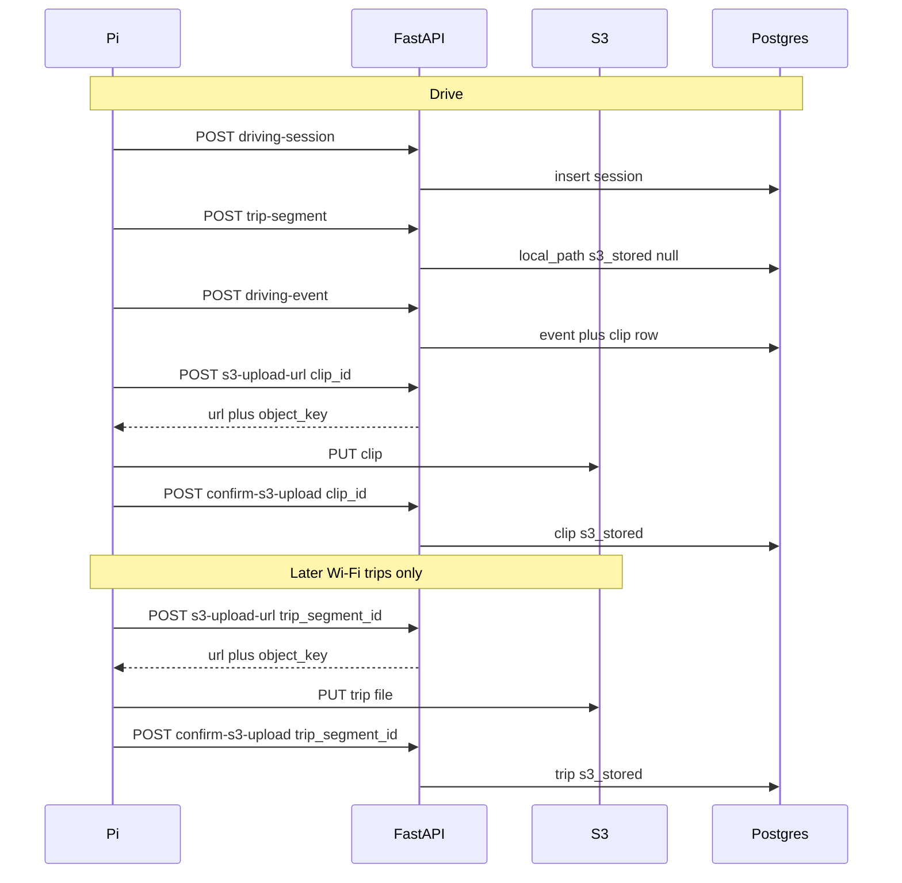

# Backend API (Pi ingest)

Pi-facing FastAPI contract: persist a driving session, prime **trip-segment** rows without sending those MP4s, persist events, and mint S3 URLs so the **edge** can PUT **event clips during the drive** and **trip files later on Wi‑Fi**. **No FastAPI route accepts file bytes.** Trip files rotate every `segment_seconds` (default 300 s) — too heavy for cellular in the lap loop. Cloud stack, the three databases (Pi SQLite local prod, Compose Postgres test-only, Supabase cloud prod), and credentials live in [cloud_architecture.md](cloud_architecture.md). Tables live in [schema_design.md](schema_design.md). Edge capture/clip writing is [event_clip_pipeline.md](event_clip_pipeline.md). Requirements: [mvs.md](../specs/mvs.md) R-6 / R-7 / R-8.

This is the **ingest** surface only. It is not a replica of SQLite and it is not the portfolio frontend API.

---

## 1. Purpose

Give the Raspberry Pi a small set of HTTP calls so that it can:

1. Ensure a **config snapshot** exists in cloud Postgres (`POST /master-config`: insert only if the operational JSON differs from every stored snapshot; otherwise reuse that `master_config.id`).
2. Open a **driving session** in cloud Postgres (same models as local SQLite), pointing at that snapshot.
3. **Prime** `trip_segment` **rows** — JSON only — so cloud Postgres knows the full-session files exist on the Pi. `s3_key` / `s3_stored` stay null until Wi‑Fi.
4. After a stop-sign encounter, persist **one driving event** and its children, then (if connected) **PUT the event clip to S3** (`s3-upload-url` → Pi PUT → `confirm-s3-upload`). Clips are 10–20 s and rare.
5. **Later, on Wi‑Fi:** PUT **trip** files the same way (`trip_segment_id`). Video never transits Render. Trip MP4s never use cellular from the run cycle.

The Pi does not hold AWS or Postgres credentials (decision 22). Device ingest uses header `X-API-Key` matching `NETRAPI_API_KEY` (TP-42; decision 46). The edge HTTP client is `netrapi.cloud_ingest.CloudIngest` (TP-49; decision 48): after each local SQLite write, the capture loop POSTs JSON and, for event clips, PUTs via a presigned URL. Before a session upsert, `sync_session` POSTs `master-config` so the FK exists (decision 56). `sync_trip_segment` is JSON-only. Trip files PUT later via `drain_trip_segments` / `main.py --drain-trips` (decision 54). Ingest failures are logged and do not abort the loop. Uploads stay **one at a time** (decision 21). **Event clips** may S3 during the drive; **trip segments** wait for Wi‑Fi (decision 33).

---

## 2. Out of scope

Do **not** design or implement these until frontend work starts:

- List / filter events, accuracy metrics, serving the React app (M-7.14, R-9)
- OAuth / Google login
- Two-way sync (Postgres → SQLite)
- Per-table REST for `clip`, `classification`, `knn_parameter`, etc. (those nest under `driving-event`)
- File attachments on FastAPI (multipart video). All `/api/netrapi/*` bodies are JSON. The Pi PUTs bytes to S3, not to Render.
- Putting **trip** MP4s to S3 from `RecordingManager.run_loop` / during the drive. Cellular (~5 minutes per `trip_recorder.json` `segment_seconds`, default 300) would burn a 75 GB/month cap. **Event clips** may PUT during the drive when connectivity exists.

---

## 3. Assumptions

- One edge device.
- Ingest routes under `/api/netrapi/*` require header `X-API-Key` (M-7.10, TP-42). `GET /health` stays open (TP-35 uvicorn, TP-37 Compose, Render). Swagger `/docs` `/redoc` `/openapi.json` are local/Compose only; off on Render (decision 59).
- Same SQLModel tables locally (SQLite) and in cloud (Supabase Postgres). Alembic `0001`–`0002` seed `classification_type` / `object_label` / initial `master_config`. `POST /master-config` find-or-creates additional snapshots when live edge JSON differs (decision 56). `classification_type` / `object_label` are still not ingest APIs.
- Paths are **singular** when the call creates or acts on one record.
- Build order matches Sprint 5/D in [test.md](../specs/test.md): TP-34 `driving-session` → TP-35 `/health` → TP-36 `driving-event` (SQLite) → Compose (TP-37) → API key (TP-42) → `s3-upload-url` (TP-43) → Pi PUT to S3 → `confirm-s3-upload` (TP-47) → local E2E via `CloudIngest` (TP-49). `trip-segment` JSON prime matches TP-34/36 but has no dedicated TP yet.
- FastAPI never receives video. Render only handles JSON + URL signing.
- **Trip S3 is post-drive / Wi‑Fi.** Event-clip S3 may run during the drive (hotspot/cellular OK — small, infrequent). JSON metadata may also go up during the drive.

---

## 3.1 When files go to S3 (data budget)

Full-session trip files rotate about every **`segment_seconds`** (default **300** s). Continuous S3 PUT of those MP4s over cellular is out of scope for the capture loop. **Stop-sign event clips** (10–20 s, only when an encounter fires) **are uploaded during the run** when the Pi is online.

| What | During the drive | Later, Wi‑Fi |
| ---- | ---------------- | ------------ |
| **Event clip** | Write local file; `driving-event` JSON; then `s3-upload-url` + PUT + confirm (`clip_id`) | Only if the in-drive PUT failed or the Pi was offline |
| **Trip segment** | Write local file; `trip-segment` JSON prime (`s3_stored` null). **No S3 PUT.** | `drain_trip_segments`: one file at a time, `s3-upload-url` (`trip_segment_id`) + PUT + confirm |

---

## 4. Sequence

**Drive:** session → prime trip rows (no trip PUT) → event JSON → **clip** PUT. **Later Wi‑Fi:** `drain_trip_segments` / `main.py --drain-trips` — **trip** PUT, one file at a time.



---

## 5. Endpoints (build order)

| Order | Endpoint | Accomplishes | Reqs / tests |
| ----- | -------- | ------------ | ------------ |
| 1 | `GET /health` | Process is up | M-7.10; TP-35 (uvicorn), TP-37 (Compose) |
| 2 | `POST /api/netrapi/master-config` | Find or create a config snapshot. Insert only if the operational payload differs from every existing snapshot; otherwise return that `id`. | decision 56 |
| 3 | `POST /api/netrapi/driving-session` | Insert **one** session (`master_config_id` + `start_time`) | M-7.11; TP-34 |
| 4 | `POST /api/netrapi/trip-segment` | Prime **one** full-session segment row (`local_path`, `init_local_stored`, times, `order_number`). **`s3_stored` stays null.** No file. | M-7.11, M-4.11; no dedicated TP yet |
| 5 | `POST /api/netrapi/driving-event` | Persist **one** detected stop-sign event plus children. May reference an already-primed `trip_segment`. | M-7.11, M-7.12; TP-36 (SQLite), TP-45 (Postgres) |
| 6 | `POST /api/netrapi/s3-upload-url` | Mint a short-lived S3 PUT URL + object key. JSON `clip_id` (during drive) **or** `trip_segment_id` (Wi‑Fi later). No file, no Postgres write. | M-6.10, M-7.15; TP-43 |
| 7 | `POST /api/netrapi/confirm-s3-upload` | After the Pi PUT, set `s3_key` / `s3_stored`. JSON only. | M-8.11; TP-47 |
| 8 | `POST /api/netrapi/s3-download-url` | Mint a short-lived S3 **GET** URL for a confirmed object. JSON `clip_id` or `trip_segment_id`. No file. | M-6.20, M-7.13; TP-46 |
| 9 | `POST /api/netrapi/confirm-local-delete` | After the Pi unlinks a local MP4, set `init_local_deleted` and clear `local_path`. JSON `clip_id` or `trip_segment_id`. Does not delete the S3 object. | M-8.11; decision 55 |

All `/api/netrapi/*` calls send header `X-API-Key` matching `NETRAPI_API_KEY` (backend/Render env; Pi `edge/.env`). Missing or wrong key is `401`. `GET /health` does not use the header.

### 5.1 `GET /health`

Unauthenticated liveness probe. Used by Docker Compose (TP-37), Render, and TP-35 (uvicorn). Does not call S3 or Postgres. TP-38/TP-39 check AWS and Supabase from backend Settings (scripts), not extra ingest routes.

Returns process liveness and the server UTC time.

```json
{
  "status": "ok",
  "time": "2026-08-16T23:05:00Z"
}
```

### 5.2 `POST /api/netrapi/master-config`

Find or create a frozen config snapshot. Fingerprint is the operational JSON (camera modes + selected mode, preview, detector + allowed class **values**, event-manager triggers, approach, motion/ROI/Farneback, kNN paths + features, recording/display, trip, buzzer). `master_config.name` / `created_at` / `note` and all row `id`s are ignored. Edge **loads** JSON at startup (`AppConfig`); this call only records which snapshot a session used (decision 58).

If the fingerprint matches any existing snapshot (including Alembic seed id 1 from live `src/main/edge/config`), return that `id` and **do not insert**. If it differs, insert a new `master_config` plus children and return the new `id`.

Pi `RecordingManager` resolve order: local SQLite find-or-create from the JSON dir, then this POST (so `driving-session.master_config_id` exists in Postgres), then `start_session` with that id. `CloudIngest.sync_session` repeats the POST so Wi‑Fi drain still has the FK.

**Response**

```json
{
  "id": 1,
  "created": false
}
```

`created` is `true` only when a new snapshot row was inserted.

### 5.3 `POST /api/netrapi/driving-session`

Drive started. One row. Session must exist before any `driving-event` for that drive.

Unknown `master_config_id` is **400**. Call §5.2 first so the snapshot exists. Unchanged live JSON reuses Alembic seed id 1.

**Minimal body**

```json
{
  "id": 1,
  "master_config_id": 1,
  "start_time": "2026-08-16T18:00:00Z"
}
```

`end_time` may be omitted until the session closes (follow-up; not required for TP-34).

Idempotent **upsert** on `id` so a retry does not duplicate the session.

### 5.4 `POST /api/netrapi/trip-segment`

Prime **one** full-session recording in Postgres (or SQLite in local smokes) **without sending the MP4**. Call this when a segment file has finished on disk (`segment_seconds` rotate or shutdown), not as an S3 upload.

**Must already exist:** `driving_session`.

**Minimal body**

```json
{
  "id": 3,
  "driving_session_id": 1,
  "local_path": "/home/pi/data/trips/seg-003.mp4",
  "init_local_stored": true,
  "file_size_bytes": 4096,
  "start_time": "2026-08-16T18:00:00Z",
  "end_time": "2026-08-16T18:05:00Z",
  "order_number": 3
}
```

Leave `s3_key` / `s3_stored` / `init_local_deleted` **omitted or null**. `file_size_bytes` is set when the local file is finished. Do not PUT this file from the run loop. Retries must not wipe `s3_key` / `s3_stored` / `init_local_deleted` once set, and must not restore `local_path` after local delete.

Idempotent upsert on `id`.

### 5.5 `POST /api/netrapi/driving-event`

One stop-sign encounter. JSON is that `event` plus nested children — not the whole database.

**Must already exist:** `driving_session` from §5.3. If the body includes `event_trip_location`, that `trip_segment` should already be primed (§5.4).

**In this body**

| Nested piece | Role |
| ------------ | ---- |
| `event` | `id`, `driving_session_id`, `time` |
| `clip` | Local clip row: `init_local_stored`, `file_size_bytes`, times, fps, frame counts. `s3_key` / `s3_stored` / `init_local_deleted` stay **null** until clip confirm / local-delete. Event retries do not wipe those flags or restore `local_path` after delete |
| `classification` + `auto_classification` | Live pipeline label |
| `knn_parameters` | Optional list of `{knn_feature_id, value}` (ids from that session’s `knn_config`) |
| `approach_parameters` | Optional measurements; optional `fail_reasons` string list → `approach_fail_reason` |
| `manual_classification` | Optional; only if review already happened on the Pi |
| `event_trip_location` | Optional `{trip_segment_id, trip_offset_seconds}`; 400 if that segment is not primed |

**Not in this body:** `driving_session` itself; video bytes (never); the full `trip_segment` row (use §5.4). `operational_exception` is a separate session-level POST (§5.9).

**Minimal body** (illustrative — not every column)

```json
{
  "id": 10,
  "driving_session_id": 1,
  "time": "2026-08-16T18:12:04Z",
  "clip": {
    "id": 10,
    "fps": 30,
    "order_number": 1,
    "num_frames": 450,
    "start_time": "2026-08-16T18:11:54Z",
    "end_time": "2026-08-16T18:12:09Z",
    "init_local_stored": true
  },
  "auto_classification": {
    "kind": "auto",
    "classification_type_id": 2,
    "stage1_classification_type_id": 4,
    "stage2_classification_type_id": 2
  }
}
```

Upsert by stable `id`s. `classification_type_id` values must already exist from Alembic seed. `knn_feature_id` values must belong to the session’s config snapshot (§5.2). Nested knn / approach / trip-location / manual fields are **optional** so TP-36’s minimal body still works.

### 5.6 `POST /api/netrapi/s3-upload-url`

JSON only. FastAPI uses **server-side AWS credentials** to mint a time-limited S3 **PUT** URL and a stable object key `device-1/{UTC-date}/{clip|trip}-{id}.mp4` (TP-44). Clip URLs expire in 15 minutes; trip URLs in 60 minutes. It does **not** store `s3_key` yet and does **not** receive the video. Missing AWS settings → 503.

The clip or trip **row must already exist** (`driving-event` for clips, `trip-segment` for full-session files). Use `clip_id` during the drive after an event; use `trip_segment_id` **after the drive, on Wi‑Fi**.

**Request**

```json
{
  "clip_id": 10
}
```

(or `"trip_segment_id": 3` instead of `clip_id` — exactly one). Optional `content_type` (default `video/mp4`).

**Response**

```json
{
  "url": "https://bucket.s3.amazonaws.com/...?X-Amz-Signature=...",
  "object_key": "device-1/2026-08-16/clip-10.mp4",
  "method": "PUT"
}
```

The Pi PUTs the MP4 **directly to `url`**. That HTTP call is S3, not FastAPI.

### 5.7 `POST /api/netrapi/confirm-s3-upload`

JSON only. After the S3 PUT succeeds, the Pi tells FastAPI the object landed. Backend **HEADs** the object, then sets `s3_key` / `s3_stored = true` on that `clip` or `trip_segment`. `object_key` must match the assigned key.

**Request**

```json
{
  "clip_id": 10,
  "object_key": "device-1/2026-08-16/clip-10.mp4"
}
```

(or `trip_segment_id` instead of `clip_id`).

**Response**

```json
{
  "object_key": "device-1/2026-08-16/clip-10.mp4",
  "s3_stored": true,
  "clip_id": 10,
  "file_size_bytes": 4096
}
```

Do not claim `s3_stored` / `s3_key` until this call succeeds. `local_path` on the Pi is not a cloud playback path. After confirm returns, `CloudIngest` copies `s3_key` / `s3_stored = true` onto the **local SQLite** clip (decision 51) or trip_segment (decision 54). FastAPI does not write the Pi database. Confirm also sets Postgres `file_size_bytes` from S3 `ContentLength` (decisions 52 and 57).

Keep uploads **one at a time**. **Clips** may PUT during the drive when online. **Trips** wait for Wi‑Fi. Files never go through FastAPI.

### 5.8 `POST /api/netrapi/s3-download-url`

JSON only. The clip or trip row must already be **confirmed** (`s3_stored` true, `s3_key` set). FastAPI mints a time-limited S3 **GET** URL (clip 15 min, trip 60 min). The object stays private; unsigned GETs to the bucket URL fail (TP-46). Frontend JWT playback can reuse this later; Sprint D authenticates with `X-API-Key`.

**Request**

```json
{
  "clip_id": 10
}
```

(or `"trip_segment_id": 3` — exactly one).

**Response**

```json
{
  "url": "https://bucket.s3.amazonaws.com/...?X-Amz-Signature=...",
  "object_key": "device-1/2026-08-16/clip-10.mp4",
  "method": "GET",
  "clip_id": 10
}
```

Missing AWS → 503. Unconfirmed object → 400.

### 5.9 `POST /api/netrapi/operational-exception`

JSON only. Session-level fault the Pi already wrote to SQLite (`ingest` failure is non-fatal; an uncaught lap error is fatal). Upsert by `id`. The `driving_session` row must already exist.

**Request**

```json
{
  "id": 7,
  "driving_session_id": 1,
  "message": "ingest sync_event failed: connection reset",
  "time": "2026-08-16T18:12:04Z",
  "is_fatal": false
}
```

### 5.10 `POST /api/netrapi/confirm-local-delete`

JSON only. After the Pi deletes a local clip or trip MP4, it tells FastAPI so Postgres matches SQLite: `init_local_deleted = true`, `local_path` cleared. Does **not** delete the S3 object or change `s3_key` / `s3_stored`. Row must already exist.

**Request**

```json
{
  "clip_id": 10
}
```

(or `"trip_segment_id": 3` — exactly one).

**Response**

```json
{
  "init_local_deleted": true,
  "local_path": null,
  "clip_id": 10
}
```

Edge entry points (no capture loop): `main.py --delete-uploaded-local` (only rows with `s3_stored` true) and `main.py --delete-all-local` (all finished local MP4s, plus leftover files in the clips/trips directories). Unfinished recordings are left on disk.

---

## 6. Table coverage

What each ingest call is allowed to write. Full column lists: [schema_design.md](schema_design.md).

| Table | `master-config` | `driving-session` | `trip-segment` | `driving-event` | `s3-upload-url` | `confirm-s3-upload` | Notes |
| ----- | ----------------- | ----------------- | -------------- | --------------- | ----------------- | ------------------- | ----- |
| `master_config` + config children | find-or-create by fingerprint | 400 if id missing | no | no | no | no | Seed id 1 reused when live JSON matches |
| `classification_type`, `object_label` | `object_label` get-or-create by value | no | no | no | no | no | `classification_type` stays Alembic-only |
| `knn_feature` | yes (per snapshot) | no | no | no | no | no | Scoped to the session’s `knn_config` |
| `driving_session` | no | yes | no | no | no | no | |
| `operational_exception` | no | no | no | no | no | no | `POST /operational-exception` |
| `event` | no | no | no | yes | no | no | One per call |
| `clip` | no | no | no | yes (local flags + `file_size_bytes`) | no | `s3_key`, `s3_stored`, `file_size_bytes` | PUT during drive; `confirm-local-delete` sets `init_local_deleted` and clears `local_path` |
| `classification`, `auto_classification`, `manual_classification` | no | no | no | yes | no | no | Manual optional |
| `knn_parameter`, `approach_parameters`, `approach_fail_reason` | no | no | no | yes | no | no | Edge persist + ingest |
| `event_trip_location` | no | no | no | optional | no | no | FK to primed `trip_segment` (row created when a trip segment opens) |
| `trip_segment` | no | no | yes (`local_path`, flags except S3, `file_size_bytes`; retries keep S3 + `init_local_deleted`) | no | no | `s3_key`, `s3_stored`, `file_size_bytes` | Prime on open; PUT on Wi‑Fi; `confirm-local-delete` sets `init_local_deleted` |

---

## 7. Open decisions

- **Row ids:** Prefer the Pi’s SQLite integer primary keys in cloud so event `id` 10 is clip `id` 10 everywhere. Revisit if two devices would collide (single Pi for MVS).
- **Dedicated TP for `trip-segment` JSON prime:** not a standalone TP; Wi‑Fi PUT is covered by TP-49 `drain_trip_segments`.

---

## 8. Related tests

| Test | Role |
| ---- | ---- |
| TP-34 | uvicorn `POST /api/netrapi/driving-session` → SQLite |
| TP-35 | uvicorn `GET /health` |
| TP-36 | uvicorn `POST /api/netrapi/driving-event` → SQLite (minimal body) |
| TP-37+ | Compose boot, backend reaches S3/Supabase, schema |
| TP-42 | API key on `/api/netrapi/*`; `/health` stays open |
| TP-43 / TP-44 / TP-47 | `s3-upload-url` + edge PUT + stable keys + confirm |
| TP-45 | `driving-event` → Postgres |
| TP-46 | unsigned object GET fails; `s3-download-url` signed GET succeeds |
| TP-48 | same PUT+confirm from hotspot/cellular (`NETRAPI_API_URL`) |
| TP-49 | Edge `CloudIngest`: SQLite event → FastAPI → clip PUT + confirm; trip drain PUT + confirm; local `s3_key` / `s3_stored` |
