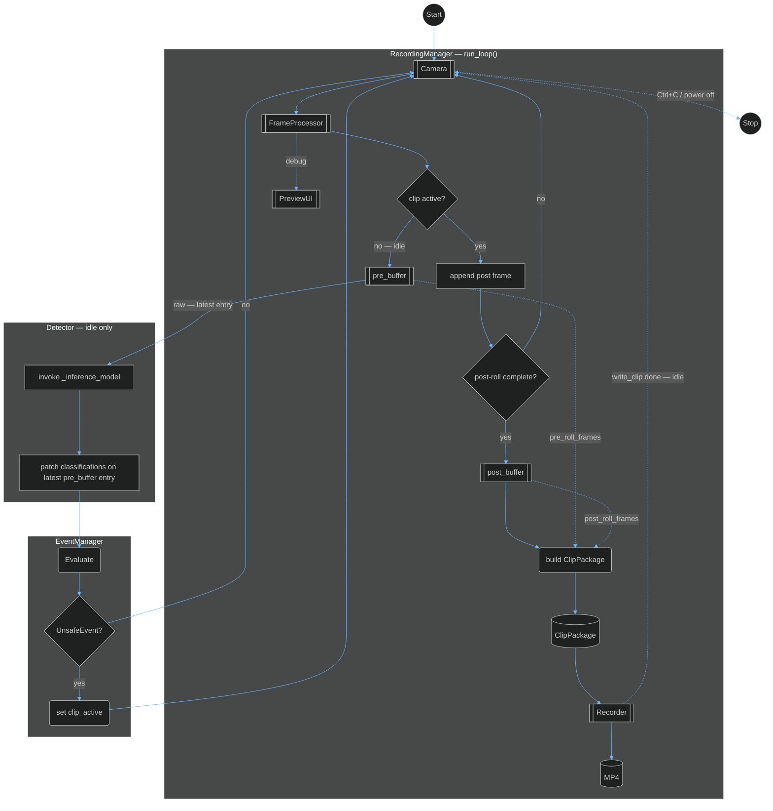
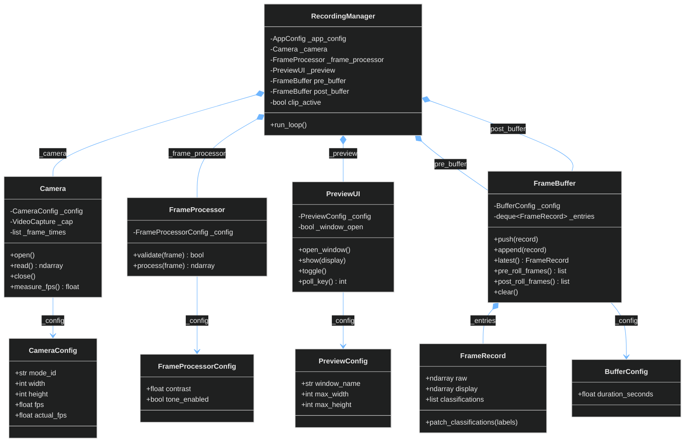
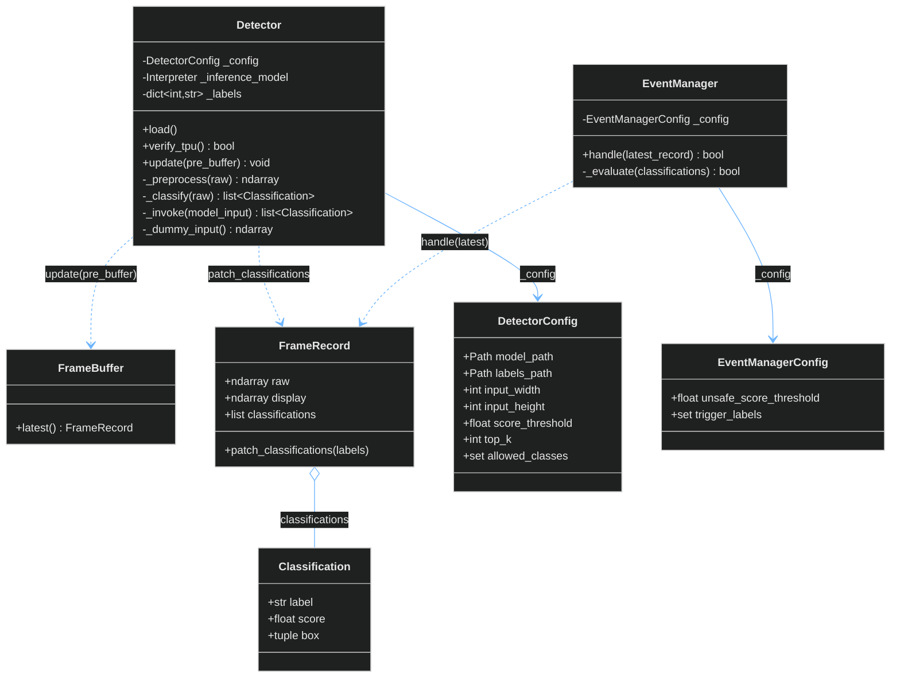
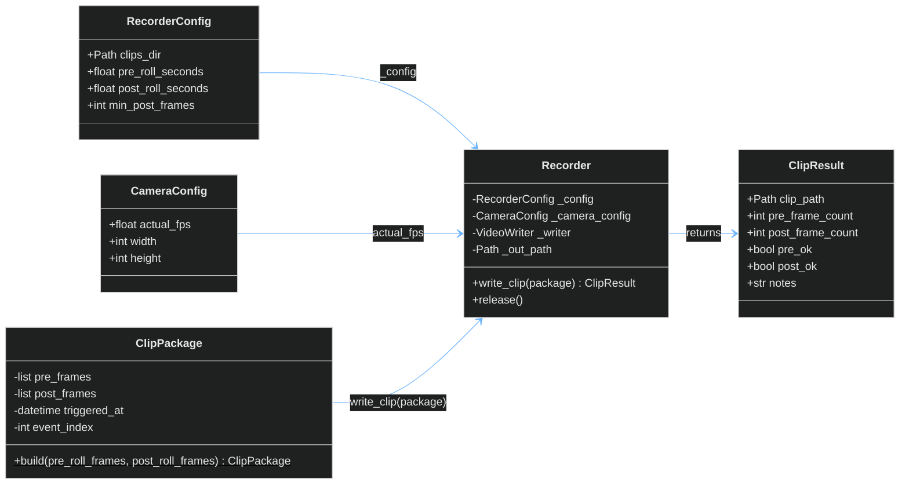
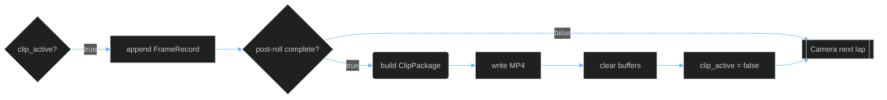
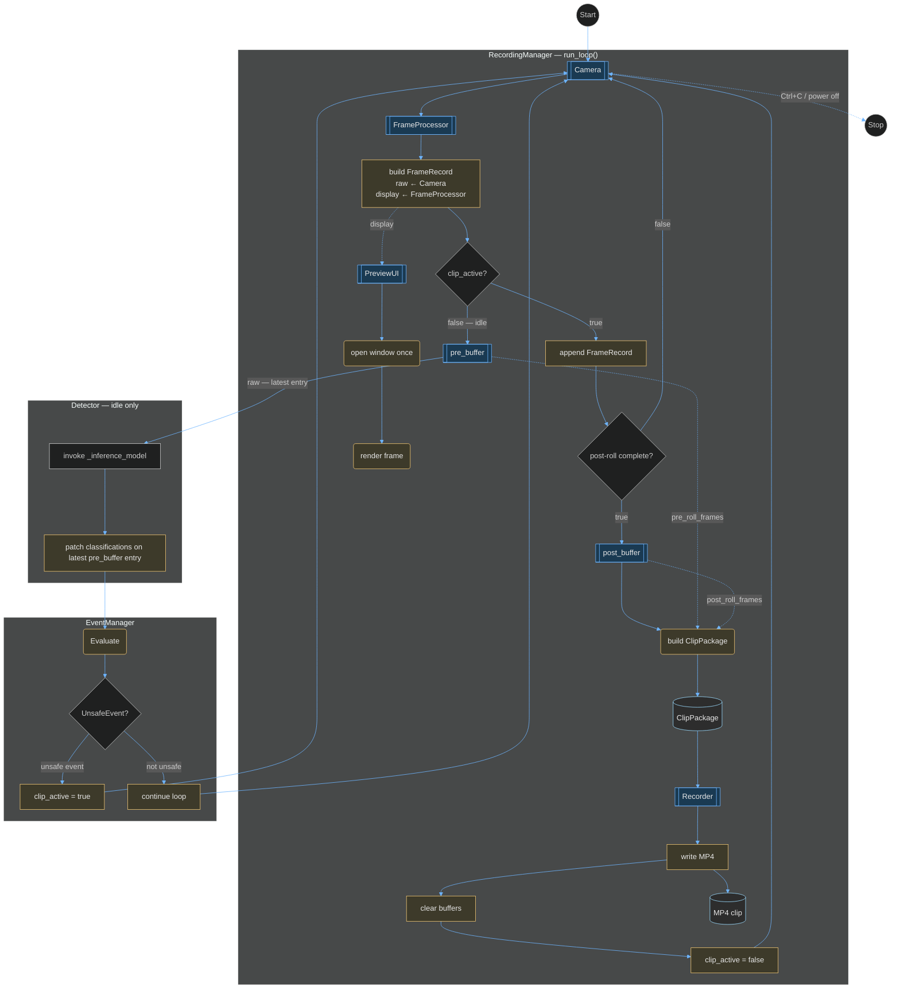

# Unsafe Event Capture Pipeline

> **Tip:** Zoom the Markdown preview (Ctrl/Cmd + mouse wheel) or open this file on GitHub full-width. Diagrams use a dark theme for readability.

### Invariants

- One **`clip_active`** clip at a time; inference and new **UnsafeEvent** handling only when idle.
- Buffers store **`FrameRecord`** entries; clip pixels come from **`display`** only (no burn-in on pixels).
- **`pre_buffer`**: rolling deque of **`FrameRecord`** while idle (`BufferConfig.duration_seconds`); no **`push`** while **`clip_active`**.
- **`post_buffer`**: **`append(FrameRecord)`** only while **`clip_active`**.
- **ClipPackage** is built from **`pre_roll_frames()`** + **`post_roll_frames()`** lists, then **`write_clip`**; then **`clear()`** both buffers.

---

## Data Path (High Level)

Matches **§4** (authoritative). Dashed = config or debug only.

---

## 2. Capture, Buffers And Configuration

Runtime classes hold `_config` and expose settings via `@property`. **`AppConfig`** loads JSON from **`src/config/`** and aggregates the sub-configs below (no capture logic on **AppConfig**).

| File | Config type |
|------|----------------|
| `src/config/camera.json` | **CameraConfig** (modes, `fps`, `actual_fps`, …) |
| `src/config/buffer.json` | **BufferConfig** (`duration_seconds` for **`pre_buffer`** rolling window) |
| `src/config/frame_processor.json` | **FrameProcessorConfig** |
| `src/config/recorder.json` | **RecorderConfig** |
| `src/config/preview.json` | **PreviewConfig** |
| `src/config/app.json` | App-level keys (e.g. selected `mode_id`, paths) — TBD |

**Composition (`*--`):** **RecordingManager** owns capture, processing, preview, and both buffers for the lifetime of **`run_loop()`**. **FrameBuffer** owns each **`FrameRecord`** in **`_entries`** (deque).

**`BufferConfig.duration_seconds`** sets how much history **`pre_buffer`** keeps (eviction by capture time on **`pre_buffer`** only). **`RecorderConfig.pre_roll_seconds`** is an optional expected pre-roll span for **`ClipResult.pre_ok`** — align with **`duration_seconds`**, not deque size.

**Memory:** **`push` / `append`** store a **`FrameRecord`** (copy **`raw`** / **`display`** as needed). **`pre_roll_frames()`** / **`post_roll_frames()`** return **new lists** (typically **`display`** arrays for **ClipPackage**). After **`write_clip`**, **`clear()`** both buffers.

### CameraConfig

| Member | Purpose |
|--------|---------|
| `mode_id` | Key for the selected row in `camera.json` |
| `width`, `height` | Capture resolution in pixels |
| `fps` | Vendor-listed rate from `v4l2-ctl --list-formats-ext` |
| `actual_fps` | Sustained rate for clips; update via setter after measurement |
| `input_format` | Pixel format (e.g. MJPEG) |
| `device` | V4L2 device path (e.g. `/dev/video0`) |

### Camera

| Member | Purpose |
|--------|---------|
| `_config` | **CameraConfig** |
| `_cap` | OpenCV / V4L2 handle |
| `_frame_times` | Timestamps per successful **`read()`** for **`measure_fps()`** |
| `open()` / `close()` | Open / release device |
| `read()` | One raw frame; record time |
| `measure_fps()` | Estimate FPS from `_frame_times` |
| `last_measured_fps` | Cache of last **`measure_fps()`** |

### FrameProcessorConfig

| Member | Purpose |
|--------|---------|
| `contrast` | Contrast applied in **`process()`** (TBD) |
| `tone_enabled` | Optional tone pass after contrast (TBD) |

### FrameProcessor

| Member | Purpose |
|--------|---------|
| `_config` | **FrameProcessorConfig** |
| `validate(frame)` | Reject bad shape/dtype |
| `process(frame)` | Return **processed** frame (contrast / tone) |

### BufferConfig

| Member | Purpose |
|--------|---------|
| `duration_seconds` | Rolling window for **`pre_buffer`** only; older **`FrameRecord`** entries evicted on **`push()`** |

### FrameRecord

| Member | Purpose |
|--------|---------|
| `raw` | Unmodified **`Camera.read()`** payload; **Detector** reads this only |
| `display` | **Processed** frame: **`FrameProcessor.process(raw)`** — **PreviewUI**, **`pre_roll_frames()`** / **`post_roll_frames()`**, and MP4 pixels (no separate “processed” type) |
| `classifications` | Labels / scores; filled after **Detector** on latest **`pre_buffer`** entry (idle) |
| `patch_classifications(...)` | Write inference result onto this record (called from **Detector**) |

`model_input` (TPU layout) is built inside **Detector** per lap and is **not** stored on **`FrameRecord`**.

### FrameBuffer

| Member | Purpose |
|--------|---------|
| `_config` | **BufferConfig** (**`pre_buffer`** uses **`duration_seconds`**; **`post_buffer`** may share) |
| `_entries` | `deque` of **`FrameRecord`** (+ monotonic time for **`pre_buffer`** eviction) |
| `push(record)` | **`pre_buffer`**, idle only; evict by **`duration_seconds`** |
| `append(record)` | **`post_buffer`**, **`clip_active`** only |
| `latest()` | Newest **`FrameRecord`** ( **`raw`** for **Detector** ) |
| `pre_roll_frames()` | **`display`** frames (oldest → newest) for **ClipPackage** |
| `post_roll_frames()` | Same for **`post_buffer`** at build time |
| `clear()` | Empty deque; drop **`FrameRecord`** references |

### RecordingManager

| Member | Purpose |
|--------|---------|
| `_app_config` | Loaded **`AppConfig`** (injected; not loaded here) |
| `_camera` | V4L2 capture |
| `_frame_processor` | Build **`FrameRecord.display`** from **`raw`** |
| `_preview` | Debug UI; shows **`display`** |
| `pre_buffer` | Rolling **`FrameRecord`** deque + inference context |
| `post_buffer` | Post-roll **`FrameRecord`** deque |
| `clip_active` | True from **UnsafeEvent** until **Done** cleanup |
| `run_loop()` | **Start** → lap logic (**§4**) → **Stop** on Ctrl+C / power off |

### PreviewConfig / PreviewUI

| Member | Purpose |
|--------|---------|
| `window_name`, `max_width`, `max_height` | Preview window (**PreviewConfig**) |
| `open_window()`, `show(frame)`, `toggle()`, `poll_key()` | Debug UI only (**PreviewUI**); **Stop** on quit key (TBD) |

---

## 2.5 Detector, Inference, And Event Evaluation

Matches **§4**: **Detector** and **EventManager** are **standalone** components — not fields on **RecordingManager**. Each idle lap, **`run_loop()`** (or equivalent orchestration) calls them after **`pre_buffer.push`**: **Detector** reads **`pre_buffer.latest().raw`**, invokes **`_inference_model`**, then **`patch_classifications`** on that entry; **EventManager** evaluates **`classifications`** and may set **`clip_active`** (rules TBD). Neither runs while **`clip_active`**.

| File | Config type |
|------|----------------|
| `src/config/detector.json` | **DetectorConfig** (model paths, thresholds, allow-list — TBD) |
| `src/config/event_manager.json` | **EventManagerConfig** (unsafe-event rules — TBD) |

**Standalone (no `*--` from RecordingManager):** **§4** shows **Detector** and **EventManager** in their own subgraphs, wired to **`pre_buffer`** / **Evaluate** by the loop — same as **Camera** or **Recorder**, which **RecordingManager** coordinates but does not subsume.

**Dependencies (`..>`):** **Detector** does not own **`pre_buffer`**; **`update(pre_buffer)`** uses **`latest()`** only when idle. **`_inference_model`** is the loaded TFLite **`Interpreter`** (Edge TPU delegate); **`model_input`** is built per lap inside **Detector** and is not stored on **FrameRecord**.

| Arrow | Meaning |
|--------|---------|
| **Detector → FrameBuffer** | Read **`raw`** from **`latest()`** entry |
| **Detector → FrameRecord** | **`patch_classifications`** after **`_classify`** |
| **EventManager → FrameRecord** | **`handle`** reads **`classifications`**; return value drives **`clip_active`** (TBD) |

### DetectorConfig

| Member | Purpose |
|--------|---------|
| `model_path` | Edge TPU–compiled `.tflite` under **`src/models/`** |
| `labels_path` | Label file (e.g. **`coco_labels.txt`**) |
| `input_width`, `input_height` | Resize target for **`_preprocess`** (from model tensor shape) |
| `score_threshold` | Drop detections below this score (≈ TP-11 `THRESHOLD`) |
| `top_k` | Cap detections passed to **`patch_classifications`** per lap |
| `allowed_classes` | Label allow-list (normalized strings; TBD) |

### Classification

| Member | Purpose |
|--------|---------|
| `label` | Human-readable class name |
| `score` | Model confidence |
| `box` | Normalized `(ymin, xmin, ymax, xmax)` or pixel coords (TBD) |

### Detector

| Member | Purpose |
|--------|---------|
| `_config` | **DetectorConfig** |
| `_inference_model` | **`tflite_runtime.Interpreter`** with Edge TPU delegate (field name only — not a separate class) |
| `_labels` | Class id → label string |
| `load()` | Allocate **`_inference_model`**; load labels |
| `verify_tpu()` | After **`load()`** (or calls **`load()`** if needed): confirm Edge TPU delegate attached and **`_invoke(_dummy_input())`** completes without error; **`True`** if healthy (call once at **Start** / before **`run_loop()`**) |
| `update(pre_buffer)` | Idle-only: **`_classify(latest().raw)`** → **`latest().patch_classifications(...)`**; skipped when **`clip_active`** |
| `_preprocess(raw)` | BGR resize / dtype layout for TPU input |
| `_classify(raw)` | **`_preprocess`** → **`_invoke`** → filtered **`list[Classification]`** |
| `_invoke(model_input)` | **`invoke()`** on **`_inference_model`**; map outputs to **Classification** |
| `_dummy_input()` | Zero/synthetic tensor matching model input shape for **`verify_tpu`** smoke invoke (not a real frame) |

### EventManagerConfig / EventManager

| Class | Member | Purpose |
|--------|---------|---------|
| **EventManagerConfig** | `unsafe_score_threshold`, `trigger_labels` | Rules for **Evaluate** (TBD; may differ from detector filter) |
| **EventManager** | `handle(latest_record)` | Run **`_evaluate(classifications)`**; return **`True`** if unsafe event → orchestration sets **`clip_active`** |
| **EventManager** | `_evaluate(classifications)` | **UnsafeEvent?** logic (TBD) |

---

## 3. Clip Package And Recorder

| Arrow | Meaning |
|--------|---------|
| **ClipPackage → Recorder** | Encode **`pre_frames`** then **`post_frames`** |
| **RecorderConfig / CameraConfig → Recorder** | Paths, timing, writer FPS (not pixels) |

### ClipPackage

| Member | Purpose |
|--------|---------|
| `pre_frames` | Copy of list passed into **`build()`** |
| `post_frames` | Copy of list passed into **`build()`** |
| `triggered_at`, `event_index` | Clip metadata |
| `build(pre_roll_frames, post_roll_frames)$` | Immutable package; called once when post-roll is complete |

### RecorderConfig

| Member | Purpose |
|--------|---------|
| `clips_dir` | Output directory for MP4s |
| `pre_roll_seconds` | Expected pre-roll duration for **`pre_ok`** (≈ **`buffer.json`** `duration_seconds`) |
| `post_roll_seconds` | Target post-roll wall time |
| `min_post_frames` | Minimum post-roll frame count (with **`actual_fps`**) |

### Recorder / ClipResult

| Class | Member | Purpose |
|--------|---------|---------|
| **Recorder** | `write_clip(package)` | Write MP4; return **ClipResult** |
| **Recorder** | `release()` | Close writer on error / **Stop** |
| **ClipResult** | `clip_path`, counts, `pre_ok`, `post_ok`, `notes` | Encode outcome |

---

## 4. How Components Connect

**§4 flowchart is the source of truth.** Each lap: **Camera** → **FrameProcessor** → build **`FrameRecord`** (`raw` + `display`) → **`clip_active?`**. Idle: **`pre_buffer.push`** → **Detector** (invoke **`_inference_model`** on latest **`raw`** → patch **`classifications`**) → **EventManager**. Clip: **`post_buffer.append`** only → **post-roll complete?** → **build** → **write MP4** → **`clip_active = false`** → **Camera**. **Detector** / **EventManager** are standalone — **`run_loop()`** calls them; they are not owned by **RecordingManager**.

### FrameRecord (runtime)

See **§2** class diagram and **FrameRecord** member table. **`FrameBuffer._entries`** is a deque of **`FrameRecord`**.

### Lap Branch (Clip Active Only)

### Clip Phases

| Phase | `clip_active` | **pre_buffer** | **post_buffer** | **ClipPackage** | **Recorder** |
|--------|---------------|----------------|-----------------|-----------------|----------------|
| **Idle** | false | `push(FrameRecord)` | empty / idle | none | idle |
| **Trigger** | true | frozen (no push) | `clear()`, ready | none | idle |
| **Collecting** | true | frozen | `append` each lap | none | idle |
| **Saving** | true | frozen | full | **`build(pre, post lists)`** | **write MP4** |
| **Done** | false | **`clear()`**, resume `push` | **`clear()`** | consumed | idle |

1. **Unsafe event:** `clip_active = true`; stop **`pre_buffer.push()`**; **`post_buffer.clear()`** → **Camera**.
2. **While `clip_active`:** **`post_buffer.append(FrameRecord)`**; no inference.
3. **Post-roll complete:** `ClipPackage.build(...)` → **write MP4** → **`clip_active = false`** → **`clear()`** both buffers.
4. **Next lap:** solid return to **Camera** (idle).
5. **Stop:** Ctrl+C, preview quit, or power loss → release camera / writers (**TBD** teardown order).

### Diagram Shapes

| Shape | Meaning |
|--------|---------|
| `[[ ]]` | Component |
| `[( )]` | Data (**Detection**, MP4, **ClipPackage**) |
| `( )` | Process step |
| `{ }` | Decision |
| `(( ))` | Start / Stop |

Solid = runtime sequence; dashed = debug (preview) or build-time frame lists.

| Piece | Role |
|--------|------|
| **FrameRecord** | Per lap: `raw`, `display`, `classifications`; **`model_input`** only inside **Detector** (not stored) |
| **RecordingManager** | Owns **`pre_buffer`**, **`post_buffer`**, **`clip_active`**, **`run_loop()`**; coordinates capture/clip path only |
| **Detector** | Standalone; idle only: **`_inference_model`** on latest **`raw`** → **`patch_classifications`** on latest **`pre_buffer`** entry |
| **Evaluate** | Rules on latest **`classifications`** → **UnsafeEvent?** (TBD) |
| **EventManager** | Standalone; **`handle(...)`** each idle lap |
| **ClipPackage** | **`build(pre_roll_frames, post_roll_frames)`** — **`display`** frames from buffer entries |
| **Recorder** | **`write_clip(package)`**; diagram step **write MP4** → file → **`clip_active = false`** → **Camera** |

### Classifications Vs UnsafeEvent

| Stage | Meaning |
|--------|---------|
| **classifications** | **Detector** output (via **`_inference_model`**) written onto the latest **`pre_buffer`** **FrameRecord** (labels / scores; rules TBD). |
| **UnsafeEvent?** | **Evaluate** decides whether to set **`clip_active`** (TBD). |
