# Unsafe Event Capture Pipeline

> **Tip:** Zoom the Markdown preview (Ctrl/Cmd + mouse wheel) or open this file on GitHub full-width. Diagrams use a dark theme for readability.

## 1. Overview

NetraPi edge captures camera frames, runs idle-only object detection, evaluates unsafe driving events, and writes short MP4 clips with pre-roll and post-roll context. **`main.py`** loads config, **`build.py`** wires components, and **`RecordingManager.run_loop()`** drives the lap loop until Ctrl+C or **`max_laps`**.

**Document map**

| Section | Contents |
|---------|----------|
| [§2 Entry point](#2-entry-point-mainpy) | CLI, **`main()`** startup, error paths |
| [§3 Pipeline assembly](#3-pipeline-assembly-buildpy) | **`build_pipeline`**, **`NetraPiPipeline`** |
| [§4 Runtime loop](#4-runtime-loop) | Component view + step-level **`run_loop`** flowchart |
| [§5 Lap detail](#5-lap-detail) | Clip phases, branch diagram, encoding FPS, shutdown |
| [§6 Configuration](#6-configuration) | JSON files, load steps, **`AppConfig`** |
| [§7 Component reference](#7-component-reference) | Class diagrams and member tables |

### 1.1 Invariants

- One **`clip_active`** clip at a time; object detection only when idle **and** **`EventManager.needs_detection`** (Watching); event evaluation when idle; neither while clip-active.
- Buffers store **`FrameRecord`** entries; clip pixels come from **`display`** only (no burn-in on pixels).
- **`pre_buffer`**: rolling deque of **`FrameRecord`** while idle (**`RecordingManagerConfig.pre_roll_seconds`**); no **`push`** while **`clip_active`**.
- **`post_buffer`**: **`append(FrameRecord)`** only while **`clip_active`**.
- **Unsafe events always begin clip capture**; **`record_safe_events`** in **`recording_manager.json`** optionally includes safe events.
- **ClipPackage** is built from **`pre_buffer.display_frames()`** + **`post_buffer.display_frames()`**, then **`write_clip`**; then **`clear()`** both buffers.

---

## 2. Entry point (`main.py`)

Source: [`src/main/edge/main.py`](../../src/main/edge/main.py)

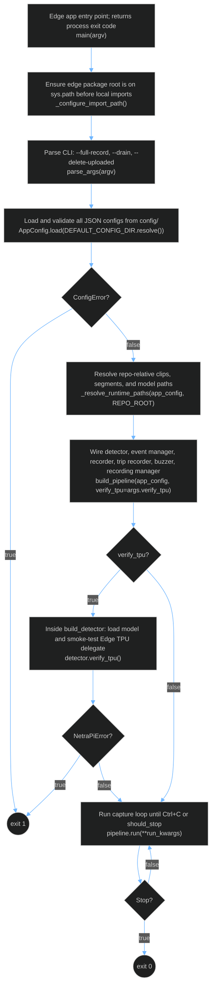

| CLI flag | Default | Effect |
|----------|---------|--------|
| **`--full-record`** / **`--no-full-record`** | config value | Passed to **`run_kwargs`**; overrides **`trip_recorder.json`** **`enabled`** |
| **`--drain {clips,trips,both}`** | (off) | Maintenance upload; does not run capture |
| **`--delete-uploaded`** | (off) | Alone or after `--drain`: unlink local MP4s already in S3 |
| **`--delete-all`** | (off) | Unlink finished local MP4s (does not delete S3) |

**Happy path:** **`main`** → import path → **`parse_args`** → **`AppConfig.load`** → **`_resolve_runtime_paths`** → **`build_pipeline`** → (optional TPU verify) → **`pipeline.run`** → exit **0**.

**Error paths:** **`ConfigError`** at load → stderr, exit **1**. **`NetraPiError`** (including TPU verify failure when **`verify_tpu`** is **true**) → stderr, exit **1**. **`KeyboardInterrupt`** during **`run`** → exit **0**.

---

## 3. Pipeline assembly (`build.py`)

Source: [`src/main/edge/netrapi/build.py`](../../src/main/edge/netrapi/build.py)

**`build_pipeline`** constructs components in dependency order, then returns a **`NetraPiPipeline`** whose **`run()`** delegates to **`RecordingManager.run_loop()`**.

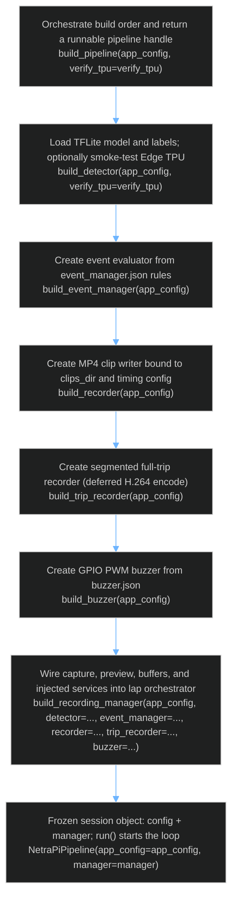

**Inside `build_recording_manager`** — each dependency is constructed and passed into **`RecordingManager`**:

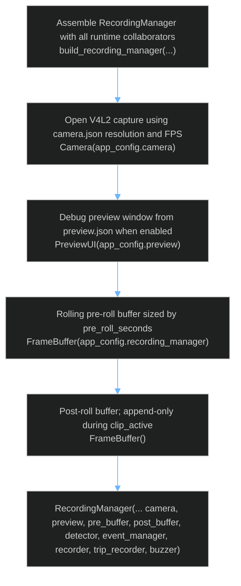

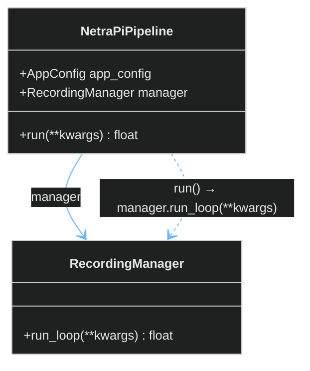

**Detector**, **EventManager**, and **Buzzer** are injected into **RecordingManager** (not composed as owned sub-objects in UML), but **`run_one_lap`** calls detector/event manager only while idle. See **§4 Runtime loop**.

| Build step | Plain terms | Code |
|------------|-------------|------|
| 1 | Load model; verify TPU when **`verify_tpu`** is **true** | **`build_detector(app_config, verify_tpu=...)`** |
| 2 | Event evaluator (approach + motion + kNN — **§7.4**) | **`build_event_manager(app_config)`** |
| 3 | Event-clip MP4 writer | **`build_recorder(app_config)`** |
| 4 | Optional full-trip segment writer | **`build_trip_recorder(app_config)`** |
| 5 | GPIO PWM buzzer (no-op when both **`play_on`** flags are false) | **`build_buzzer(app_config)`** |
| 6 | Camera + preview + buffers + injected services | **`build_recording_manager(...)`** |
| 7 | Return wired session | **`NetraPiPipeline(app_config=..., manager=...)`** |

---

## 4. Runtime loop

**Authoritative** step-level flowchart is in [§4.2](#42-step-level-flowchart). Component collaboration (who talks to whom) is in [§4.1](#41-component-view).

### 4.1 Component view

Major runtime collaborators. **RecordingManager** is the hub; details are in [§4.2](#42-step-level-flowchart).

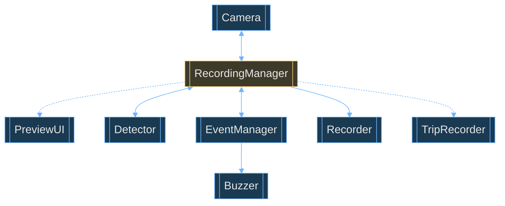

### 4.2 Step-level flowchart

Solid = lap control flow. Dashed = preview or buffer store / **`display_frames`** feeds.

**Why no Mermaid subgraphs in this diagram:** Mermaid routes cross-subgraph links to the **cluster border**, so a reader cannot see which step resumes inside **RecordingManager**. Component identity is shown in the **node label** (`RecordingManager · …`, `Detector · …`, etc.) and color instead — every arrow is node → node. Use [§4.1](#41-component-view) for the boxed component picture.

Idle orchestration (once per idle lap): **`pre_buffer.push`** → **if `needs_detection` (current state is `'Watching'`)** → **Detector.classify(raw)** → **`patch_classifications`** → **EventManager.observe(pre_buffer)** → **if `ready_to_evaluate`** → **EventManager.evaluate()** → **`Buzzer.beep(event)`** (non-blocking; gated by **`buzzer.json`** **`play_on`**) → clip gate **`event.is_unsafe or record_safe_events`** → set **`clip_active = true`** / **`begin_clip()`** or continue loop. While **CollectPostDrop**, skip the detector (motion-only observe). **Detector** and **EventManager** do not run while **`clip_active`**.

**EventManager output:** **Safe** (`COMPLETE_STOP`) or **Unsafe** subtypes **Rolling** (`ROLLING_STOP`) / **Run-through** (`RUN_THROUGH`) — see [event_detection.md](event_detection.md). **`observe`** collects every idle lap; **`evaluate()`** runs only when the post-drop window finishes and always returns a **`DrivingEvent`** (never **`None`**).

**Note:** **`_prepare_display`** runs inside **`_capture_frame_record`** (not a separate lap step). Post-roll complete is **wall-clock**: **`time.monotonic() - _post_roll_started_at >= post_roll_seconds`** (see **§5**).

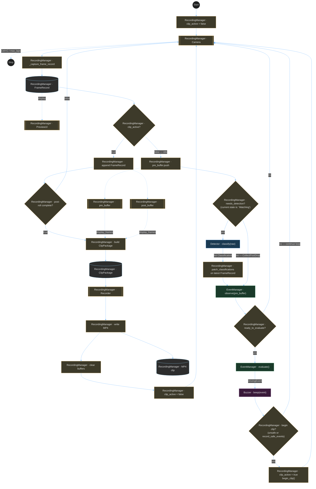

| Color / prefix | Component |
|----------------|-----------|
| Gold border · `RecordingManager ·` | Orchestrator (buffers, **`clip_active`**, clip write) |
| Blue · `Detector ·` | Object detection |
| Green · `EventManager ·` | Observe / evaluate |
| Purple · `Buzzer ·` | Alert |

Solid = runtime sequence; dashed = preview, buffer store, or **`display_frames`** lists for **ClipPackage**.

| Piece | Role |
|--------|------|
| **FrameRecord** | Per lap: **`raw`**, **`display`**, **`classifications`**; **`model_input`** only inside **Detector** (not stored) |
| **RecordingManager** | Owns buffers, **`clip_active`**, **`run_loop()`**; orchestrates Detector / EventManager / Buzzer when idle |
| **Detector** | Idle when current state is **`'Watching'`**: **`classify(raw)`** → classifications patched onto latest **FrameRecord** |
| **EventManager** | **`observe(pre_buffer)`** every idle lap; **`evaluate()`** → **`DrivingEvent`** when **`ready_to_evaluate`**. Owns area/motion deques; Watching → CollectPostDrop → kNN → emit (see [event_detection.md](event_detection.md)) |
| **Buzzer** | **`open()`** / **`close()`** with **`run_loop`**; **`beep(event)`** after evaluate (daemon-thread PWM; gated by **`play_on`**; soft-fail) |
| **ClipPackage** | **`build(pre_frames, post_frames)`** from **`display_frames()`** on both buffers |
| **Recorder** | **`write_clip(package, fps)`** → **ClipResult**; **`fps`** from buffer timestamps at write time |
| **`clip_active`** | Explicit flag: **`false`** at start (**`Start → clip_active = false → Camera`**) and after clip write; **`true`** when begin-clip gate passes (**`begin_clip()`**) |

---

## 5. Lap detail

### 5.1 Clip phases

| Phase | `clip_active` | **pre_buffer** | **post_buffer** | **ClipPackage** | **Recorder** |
|--------|---------------|----------------|-----------------|-----------------|----------------|
| **Idle** | false | `push(FrameRecord)` | empty / idle | none | idle |
| **Trigger** | true | frozen (no push) | `clear()`, ready | none | idle |
| **Collecting** | true | frozen | `append` each lap | none | idle |
| **Saving** | true | frozen | full | **`build(pre, post lists)`** | **write MP4** |
| **Done** | false | **`clear()`**, resume `push` | **`clear()`** | consumed | idle |

1. **Event gate:** **`begin_clip()`** sets **`clip_active = true`**, records **`_post_roll_started_at`**, **`post_buffer.clear()`**.
2. **While `clip_active`:** **`post_buffer.append(FrameRecord)`** only; no inference.
3. **Post-roll complete:** wall-clock elapsed ≥ **`post_roll_seconds`** → **ClipPackage.build** → **write_clip** → **`clip_active = false`** → **`clear()`** both buffers.
4. **Next lap:** return to idle path at **Camera**.

### 5.2 Lap branch (clip active)

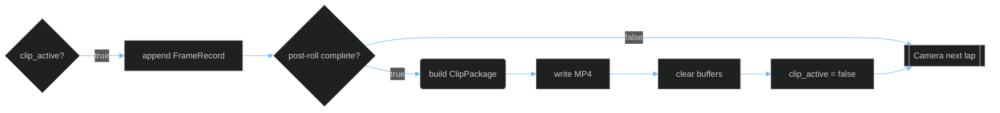

### 5.3 Encoding FPS (clips and trips)

MP4 output uses **ffmpeg H.264** (`libx264`, `yuv420p`) via **`write_h264_mp4()`** — **ffmpeg must be on PATH**. There is **no FPS warmup** at **`run_loop()`** start.

**Clips:** While **`clip_active`**, frames stay in **`pre_buffer`** / **`post_buffer`**. At post-roll complete, **`_finish_clip()`** merges buffer **`capture_span()`** timestamps and calls **`clip_encoding_fps()`** — **`frame_count / elapsed`**. Invalid span (**`< 2`** frames or **`elapsed ≤ 0`**) raises **`RecordingError`** (no catalog fallback). **`Recorder.write_clip(package, fps)`** encodes once.

**Trips:** **`TripRecorder.append_frame()`** appends each lap's **`display`** frame to an in-RAM segment list (no writer during capture). On segment rotate or **`stop()`**, **`_finalize_segment()`** computes **`fps = frame_count / wall_elapsed`** and calls **`write_h264_mp4()`** once, then clears the buffer.

**Camera config:** **`camera.json`** requires **`spec_fps`** (vendor-listed) and **`recommended_fps`** (V4L2 **`CAP_PROP_FPS`** at open). Neither is used for MP4 encoding after this change.

### 5.4 Shutdown

**`run_loop()`** installs a **SIGINT** handler that sets **`_running = false`**. On exit (**`finally`**): restore previous handler, **`buzzer.close()`**, **`camera.close()`**, **`recorder.release()`**, **`trip_recorder.stop()`**. Preview uses OpenCV when **`preview.json`** **`enabled`**; quit/stop is via Ctrl+C on the process (no separate headless env toggle).

### 5.5 Classifications vs DrivingEvent

| Stage | Meaning |
|--------|---------|
| **classifications** | **Detector** output; **RecordingManager** writes onto latest **`pre_buffer`** entry via **`patch_classifications`**. |
| **DrivingEvent** | **EventManager.evaluate()** returns when ready; **`StopSignEnum`** sets **`is_unsafe`** — **`COMPLETE_STOP`** is safe; **`ROLLING_STOP`** and **`RUN_THROUGH`** are unsafe. Clip gate: **`event.is_unsafe or record_safe_events`**. Beep gate (separate): **`buzzer.json`** **`play_on.unsafe`** / **`play_on.safe`**. |

---

## 6. Configuration

Runtime classes hold **`_config`** and expose settings via **`@property`**. **`AppConfig`** loads JSON from **`src/main/edge/config/`** and aggregates sub-configs (no capture logic on **AppConfig**).

| File | Config type |
|------|----------------|
| `camera.json` | **CameraConfig** (modes, **`spec_fps`**, **`recommended_fps`**, …) |
| `recording_manager.json` | **RecordingManagerConfig** (**`pre_roll_seconds`**, **`post_roll_seconds`**, **`coverage_tolerance`**, **`display`**, **`record_safe_events`**, **`ffmpeg_crf`**, **`clips_dir`**) |
| `preview.json` | **PreviewConfig** |
| `detector.json` | **DetectorConfig** |
| `event_manager.json` | **EventManagerConfig** (`trigger_labels`, `area_history_seconds`) |
| `approach_config.json` | **ApproachConfig** (`winner_pf02` thresholds) |
| `motion_config.json` | **MotionConfig** (ROI, Farneback, `stopped_motion_threshold`, `post_drop_window_s`) |
| `knn_config.json` | **KnnConfig** (feature lists, `k`, **`stage1_model_path`** / **`stage2_model_path`**) |
| `trip_recorder.json` | **TripRecorderConfig** (**`segments_dir`**, **`segment_seconds`**, **`ffmpeg_crf`**; optional via CLI **`--full-record`**) |
| `buzzer.json` | **BuzzerConfig** (**`gpio_pin`**, **`volume`**, **`pitch`**, **`duration_seconds`**, **`play_on.unsafe`** / **`play_on.safe`**) |

Model artifacts under `models/`: `knn_stage1.joblib`, `knn_stage2.joblib` — serialized kNN pipelines loaded at runtime (no training set on device). See [event_detection.md](event_detection.md) §8–§9.

JSON on disk is read **once at startup** by **`AppConfig.load(EDGE_DIR / "config")`**. **`main._resolve_runtime_paths`** makes repo-relative paths absolute. **`build_pipeline(app_config, verify_tpu=...)`** wires typed **`*Config`** objects into pipeline components. **`RecordingManager.run_loop()`** does not open config files.

**Principles:** load once (no hot reload in v1); fail fast on invalid JSON (TP-17); each runtime class holds **`_config`** and exposes settings via **`@property`**.

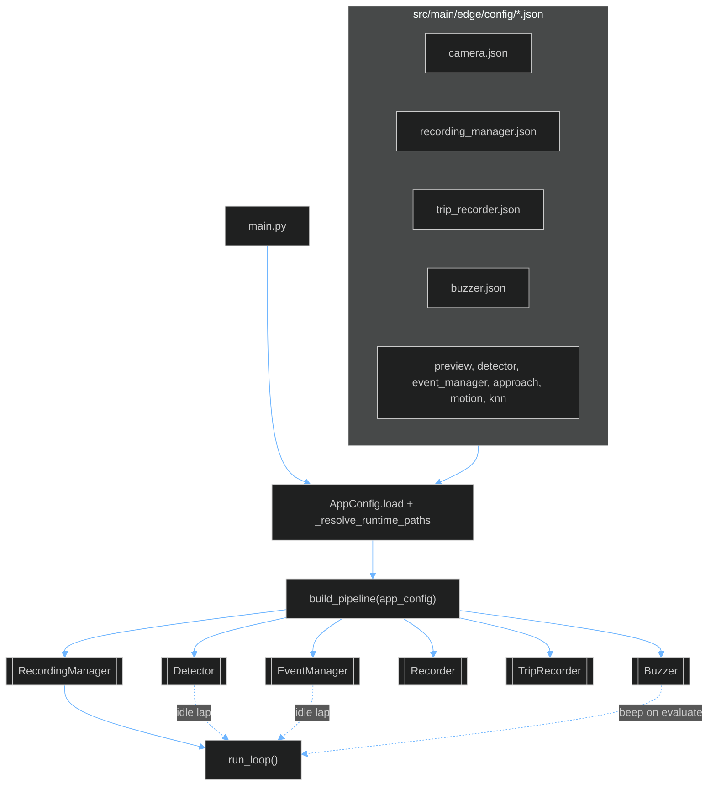

**`AppConfig` composition** (each child loads from one JSON via **`from_json`**; full fields in `config/types.py`):

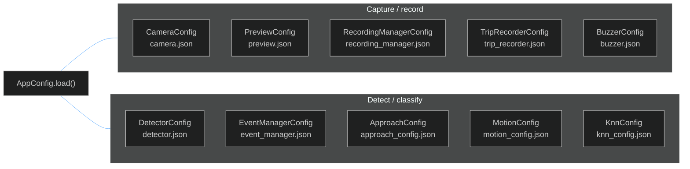

| Config | Fields that matter most at runtime |
|--------|--------------------------------------|
| **CameraConfig** | `device`, `width`/`height`, `recommended_fps` |
| **RecordingManagerConfig** | `clips_dir`, `pre_roll_seconds`, `post_roll_seconds`, `record_safe_events` |
| **PreviewConfig** | `enabled`, window size/position |
| **DetectorConfig** | `model_path`, `labels_path`, `score_threshold`, `allowed_classes` |
| **EventManagerConfig** | `trigger_labels`, `area_history_seconds` |
| **ApproachConfig** | peak / approach / drop thresholds (`winner_pf02`) |
| **MotionConfig** | `stopped_motion_threshold`, `post_drop_window_s`, ROI |
| **KnnConfig** | `k_neighbors`, stage-1/2 `model_path`s |
| **TripRecorderConfig** | `enabled`, `segments_dir`, `segment_seconds` |
| **BuzzerConfig** | `gpio_pin`, `play_on.unsafe` / `play_on.safe` (`enabled` = either true) |

| Step | What happens |
|------|----------------|
| 1 | **`AppConfig.load(EDGE_DIR / "config")`** — fixed config directory |
| 2 | Read each domain JSON → **`*Config.from_json(...)`** |
| 3 | **`_resolve_runtime_paths`**: repo-relative **`clips_dir`**, **`segments_dir`**, model/label paths (and planned kNN **`model_path`**s) |
| 4 | **`build_pipeline(app_config, verify_tpu=...)`** — **`recording_manager`** shared by **`pre_buffer`** and **Recorder**; **TripRecorder** from **`trip_recorder.json`**; **Buzzer** from **`buzzer.json`** |
| 5 | **`run_loop()`** — components use injected configs only |

**Clip timing (one file):** **`recording_manager.json`** — **`pre_roll_seconds`** = rolling **`pre_buffer`** window; **`post_roll_seconds`** = wall-clock post-roll gate; **`coverage_tolerance`** = **`ClipResult.pre_ok`** / **`post_ok`** frame-count checks in **Recorder**; **`clips_dir`** = MP4 output; **`record_safe_events`** = optional safe-event clips (unsafe always record); **`ffmpeg_crf`** = H.264 quality for clip encode.

---

## 7. Component reference

### 7.1 Capture

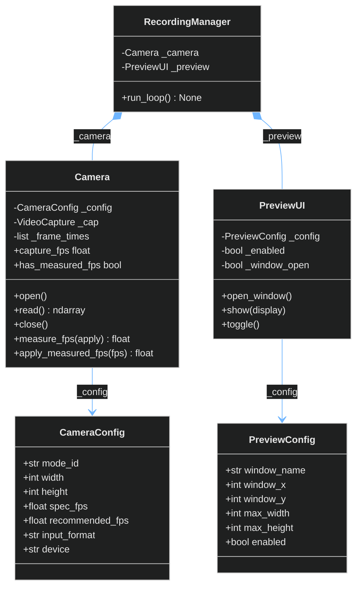

**CameraConfig**

| Member | Purpose |
|--------|---------|
| `mode_id` | Active mode: root key in **`camera.json`**; must match one **`modes[].id`** |
| `width`, `height` | Capture resolution in pixels |
| `spec_fps` | Vendor-listed rate from **`v4l2-ctl --list-formats-ext`** (documentation / validation) |
| `recommended_fps` | Value set on V4L2 **`CAP_PROP_FPS`** at **`Camera.open()`** |
| `input_format` | Pixel format (e.g. MJPEG) |
| `device` | V4L2 device path (e.g. **`/dev/video0`**) |

**Camera**

| Member | Purpose |
|--------|---------|
| `_config` | **CameraConfig** |
| `_cap` | OpenCV / V4L2 handle |
| `_frame_times` | Timestamps per successful **`read()`** for **`measure_fps()`** |
| `open()` / `close()` | Open / release device; **`CAP_PROP_FPS`** from **`recommended_fps`** |
| `read()` | One raw frame; shape validated vs **CameraConfig**; record timestamp |
| `capture_fps` | **`recommended_fps`** (or applied measured rate if **`measure_fps(apply=True)`** was used elsewhere) — **not** used for MP4 encoding |
| `measure_fps(apply=False)` | **`len(_frame_times) / (last − first)`**; optional **`apply`** |
| `apply_measured_fps(fps)` | **`cap.set(CAP_PROP_FPS, fps)`** |
| `has_measured_fps` / `last_measured_fps` | Explicit measurement state |

**PreviewConfig / PreviewUI**

| Member | Purpose |
|--------|---------|
| `window_name`, `window_x`, `window_y`, `max_width`, `max_height`, `enabled` | Preview window layout (**PreviewConfig**) |
| `open_window()`, `show(frame)`, `toggle()` | OpenCV window when **`enabled`**; shows **`display`** (same pixels as MP4 when display processing is on); **`toggle_key`** toggles runtime **`enabled`** |

Display tone/contrast for MP4 pixels lives in **`recording_manager.json` → `display`** (**§7.2** **`RecordingManager._prepare_display`**).

### 7.2 Buffers

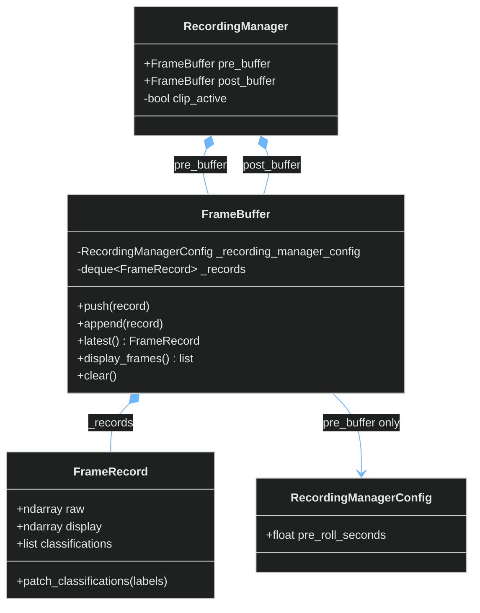

**Composition:** **RecordingManager** owns both buffers for the lifetime of **`run_loop()`**. **FrameBuffer** owns each **`FrameRecord`** in **`_records`**.

**`RecordingManagerConfig.pre_roll_seconds`** sets how much history **`pre_buffer`** keeps (eviction by capture time on **`push`** only). **`post_buffer`** is append-only (no rolling eviction).

**Memory:** **`push` / `append`** store a **`FrameRecord`** (copy **`raw`** / **`display`** as needed). **`display_frames()`** returns a **new list** of **`display`** arrays per buffer. After **`write_clip`**, **`clear()`** both buffers.

**FrameRecord**

| Member | Purpose |
|--------|---------|
| `raw` | Unmodified **`Camera.read()`** payload; **Detector** reads this only |
| `display` | Processed frame from **`RecordingManager._prepare_display`** — **PreviewUI**, **`display_frames()`**, and MP4 pixels |
| `classifications` | Labels / scores; filled on latest **`pre_buffer`** entry after **Detector** (idle) |
| `patch_classifications(...)` | Write inference result onto this record (called from **RecordingManager**) |

`model_input` (TPU layout) is built inside **Detector** per lap and is **not** stored on **`FrameRecord`**.

**FrameBuffer**

| Member | Purpose |
|--------|---------|
| `_recording_manager_config` | **`RecordingManagerConfig`** on **`pre_buffer`** (uses **`pre_roll_seconds`**); **`post_buffer`** has no config (append-only) |
| `_records` | **`deque`** of **`FrameRecord`** (+ monotonic time for **`pre_buffer`** eviction) |
| `push(record)` | **`pre_buffer`**, idle only; evict by **`pre_roll_seconds`** |
| `append(record)` | **`post_buffer`**, **`clip_active`** only |
| `latest()` | Newest **`FrameRecord`** (**`raw`** for **Detector**) |
| `display_frames()` | **`display`** frames (oldest → newest) for **ClipPackage** |
| `clear()` | Empty deque; drop **`FrameRecord`** references |

**RecordingManager** (buffer-related)

| Member | Purpose |
|--------|---------|
| `_prepare_display()` | Build **`FrameRecord.display`** from **`raw`** using **`RecordingManagerConfig.display`** |
| `pre_buffer` / `post_buffer` | Rolling idle deque + post-roll deque |
| `clip_active` | True from event gate until **Done** cleanup |
| `run_loop()` | Open camera → lap loop → teardown; returns **`None`** |
| `begin_clip()` | Set **`clip_active`**, **`_post_roll_started_at`**, clear **`post_buffer`** |

### 7.3 Detection

**Idle Watching lap (sequential — not parallel):** when **`EventManager.needs_detection`** is true, **RecordingManager** calls **`classify`**, waits for the returned list, then **`patch_classifications`** on the latest **`pre_buffer`** entry. During **CollectPostDrop**, this step is skipped.

```python
if self._event_manager.needs_detection:
    classifications = self._detector.classify(record.raw)
    self.pre_buffer.latest().patch_classifications(classifications)
self._event_manager.observe(self.pre_buffer)
if self._event_manager.ready_to_evaluate:
    event = self._event_manager.evaluate()
    self._buzzer.beep(event)
    if event.is_unsafe or self._app_config.recording_manager.record_safe_events:
        self.begin_clip()
```

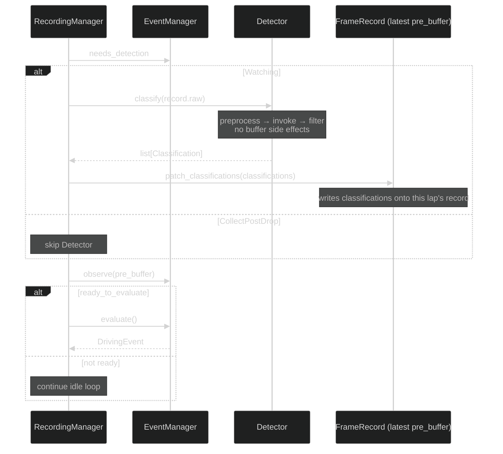

**Class structure** (orchestration order is in the sequence diagram above):

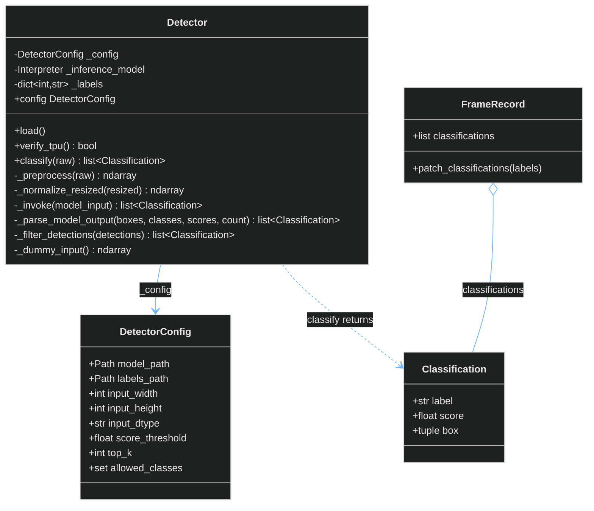

**Standalone:** **Detector** has no reference to **`FrameBuffer`** or **`FrameRecord`**. **`classify(raw)`** is read-only inference; **RecordingManager** owns the two-step handoff above. See **§4 Runtime loop**.

**DetectorConfig**

| Member | Purpose |
|--------|---------|
| `model_path` | Edge TPU–compiled **`.tflite`** under **`src/main/edge/models/`** |
| `labels_path` | Label file (e.g. **`coco_labels.txt`**) |
| `input_width`, `input_height` | Resize target for **`_preprocess`** |
| `input_dtype` | **`"uint8"`** or **`"float32"`** — normalization in **`_normalize_resized`** |
| `score_threshold` | Drop detections below this score in **`_filter_detections`** |
| `top_k` | Cap detections returned by **`classify`** per lap |
| `allowed_classes` | Label allow-list applied in **`_filter_detections`** |

**Classification**

| Member | Purpose |
|--------|---------|
| `label` | Human-readable class name |
| `score` | Model confidence |
| `box` | Normalized **`(ymin, xmin, ymax, xmax)`** |

**Detector**

| Member | Purpose |
|--------|---------|
| `_config` | **DetectorConfig** |
| `_inference_model` | **`tflite_runtime.Interpreter`** with Edge TPU delegate |
| `_labels` | Class id → label string; loaded by **`load()`** |
| `load()` | Load labels + allocate **`_inference_model`**; idempotent |
| `verify_tpu()` | After **`load()`**: smoke **`_invoke(_dummy_input())`** |
| `classify(raw)` | **`_preprocess`** → **`_invoke`** → **`_filter_detections`**; no buffer side effects |

### 7.4 Events

> **Shipped:** **`EventManager.observe`** runs Watching → CollectPostDrop collection; **`evaluate()`** emits **`DrivingEvent`** at window end (never **`None`**). Design SoT: [event_detection.md](event_detection.md).

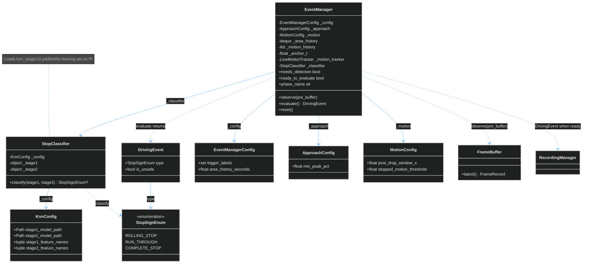

| Arrow | Meaning |
|--------|---------|
| **EventManager ..> FrameBuffer** | **`observe(pre_buffer)`** reads latest entry (classifications + frame for motion) |
| **EventManager ..> DrivingEvent** | **`evaluate()`** returns **`DrivingEvent`** when ready (emit at post-drop window end) |
| **EventManager → StopClassifier** | Window end: build features → **`classify`** → **`StopSignEnum`** |
| **StopClassifier → model files** | Startup load of serialized kNN pipelines (joblib); paths from **KnnConfig** |
| **EventManager → RecordingManager** | **RecordingManager** sets **`clip_active`** when **`ready_to_evaluate`** and **`event.is_unsafe or record_safe_events`** |

**EventManagerConfig / EventManager / StopClassifier**

| Class | Member | Purpose |
|--------|---------|---------|
| **EventManagerConfig** | `trigger_labels`, `area_history_seconds` | Labels for area series; time-evicted area history window |
| **ApproachConfig** | `winner_pf02` thresholds | Grow → peak → drop gates |
| **MotionConfig** | ROI, Farneback, `post_drop_window_s`, `stopped_motion_threshold` | CollectPostDrop motion |
| **KnnConfig** | feature lists, `k`, model paths | Provenance + load paths — not training rows |
| **StopClassifier** | `classify(stage1, stage2)` | Stage-1 then optional stage-2 → **`StopSignEnum`** |
| **DrivingEvent** | `type` (**`StopSignEnum`**), `is_unsafe` property | **`COMPLETE_STOP`** → safe; **`ROLLING_STOP`** / **`RUN_THROUGH`** → unsafe |
| **EventManager** | `_area_history`, `_motion_history`, `_anchor_t`, `_motion_tracker` | Runtime FSM state (see [event_detection.md](event_detection.md) §3.2) |
| **EventManager** | `observe` / `evaluate()` | Watching / CollectPostDrop; emit at window end |

### 7.5 Recording

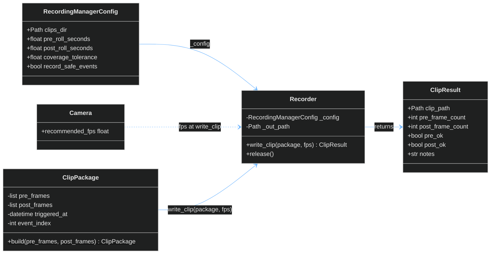

| Arrow | Meaning |
|--------|---------|
| **ClipPackage → Recorder** | Encode **`pre_frames`** then **`post_frames`** |
| **RecordingManagerConfig → Recorder** | **`clips_dir`**, timing / **`coverage_tolerance`** for **`ClipResult`** |
| **Camera ..> Recorder** | **`write_clip(..., fps)`** — **`fps`** from **`clip_encoding_fps()`** at **`_finish_clip()`** |

**ClipPackage**

| Member | Purpose |
|--------|---------|
| `pre_frames` | Deep copy of display **`ndarray`** list passed into **`build()`** |
| `post_frames` | Deep copy of display **`ndarray`** list passed into **`build()`** |
| `triggered_at`, `event_index` | Clip metadata |
| `build(pre_frames, post_frames)$` | Immutable package; called once when post-roll is complete |

**RecordingManagerConfig** (recorder / coverage)

| Member | Purpose |
|--------|---------|
| `clips_dir` | Output directory for MP4s |
| `pre_roll_seconds` | Rolling **`pre_buffer`** window and expected pre-roll for **`ClipResult.pre_ok`** |
| `post_roll_seconds` | Target post-roll wall time (gate in **RecordingManager**; coverage check in **Recorder**) |
| `coverage_tolerance` | Fraction of target seconds required for **`pre_ok`** / **`post_ok`** (**`(frame_count / fps) >= seconds * tolerance`**) |
| `record_safe_events` | When **`true`**, safe **`DrivingEvent`** types also begin clips |
| `ffmpeg_crf` | H.264 constant rate factor for clip encode (**`write_h264_mp4`**) |
| `display` | Contrast / tone for **`_prepare_display`** |

**Recorder / ClipResult**

| Class | Member | Purpose |
|--------|---------|---------|
| **Recorder** | `write_clip(package, fps)` | Encode MP4 via **ffmpeg H.264**; return **ClipResult** |
| **Recorder** | `release()` | Clear active output path on error / **Stop** |
| **ClipResult** | `clip_path`, counts, `pre_ok`, `post_ok`, `notes` | Encode outcome |

**TripRecorder** (optional full-trip mode)

Separate from event clips. When **`main.py --full-record`** (or **`trip_recorder.json`** **`enabled: true`**), **RecordingManager** appends each lap's **`display`** frame to **TripRecorder**, which buffers frames in RAM per segment and encodes **once** at rotate or shutdown. Segment wall time is **`segment_seconds`** (default **300**); output under **`segments_dir`**. Event **`Recorder`** / **ClipPackage** flow is unchanged.

| Member / setting | Purpose |
|------------------|---------|
| `segments_dir` | Output directory for **`trip_*_seg_*.mp4`** files |
| `segment_seconds` | Wall-clock duration per segment before rotate + encode |
| `ffmpeg_crf` | H.264 quality for trip segment encode |
| `enabled` | Default off; CLI **`--full-record`** overrides at runtime |

Encoding FPS per segment: **`frame_count / wall_elapsed`** at finalize (see **§5.3**). Requires **ffmpeg** on PATH.

### 7.6 Diagram legend

| Shape | Meaning |
|--------|---------|
| `[[ ]]` | Component |
| `[( )]` | Data (**Detection**, MP4, **ClipPackage**) |
| `( )` | Process step |
| `{ }` | Decision |
| `(( ))` | Start / Stop |
