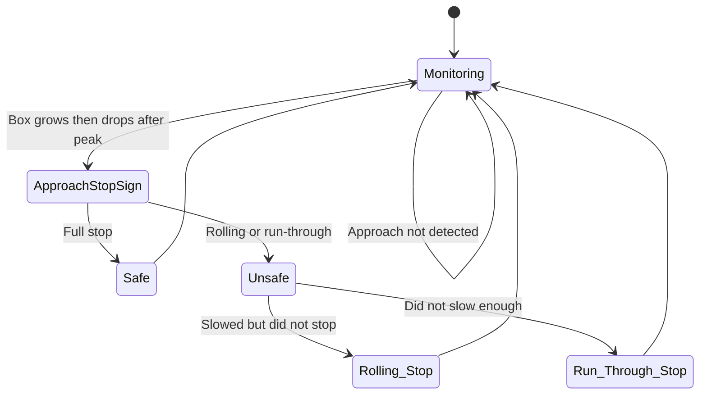
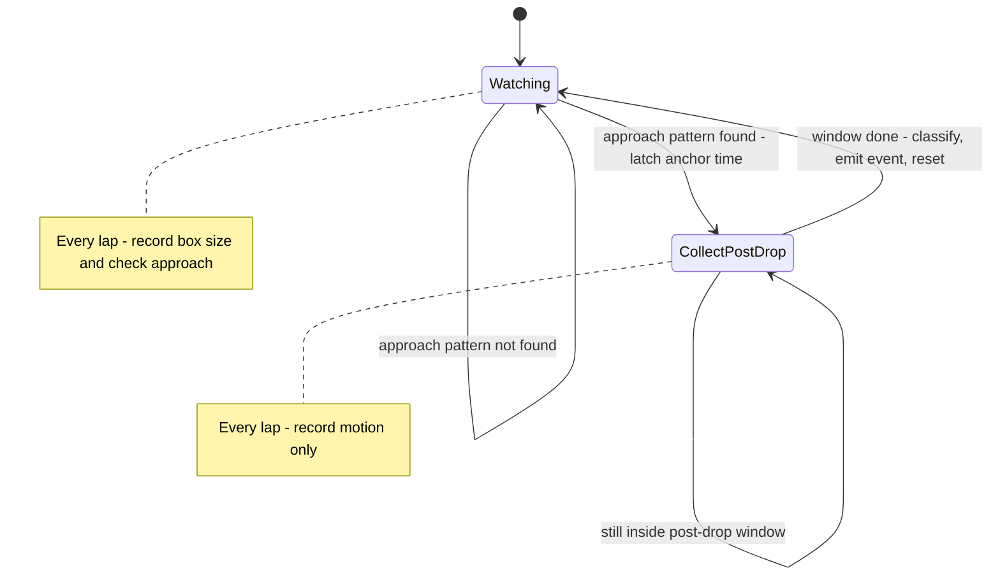
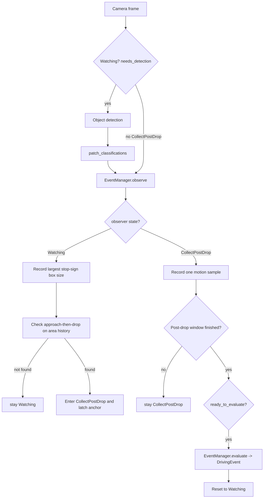
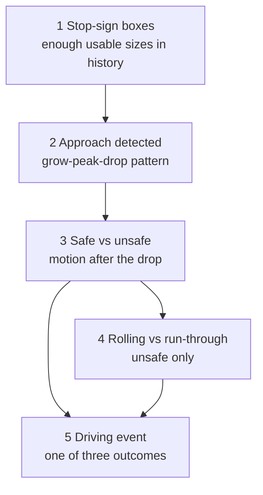
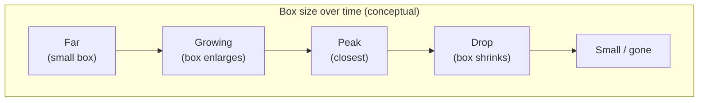
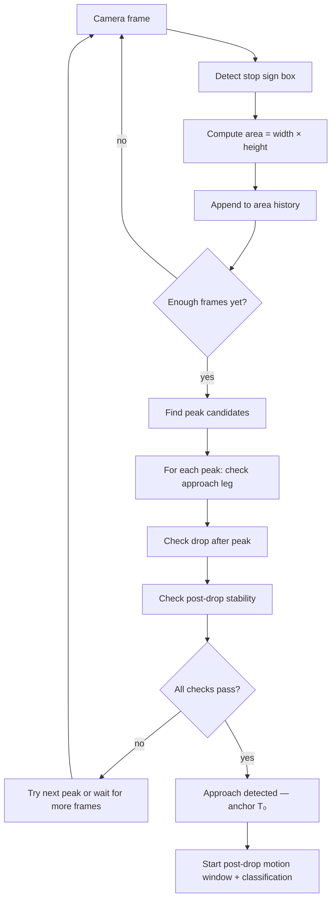
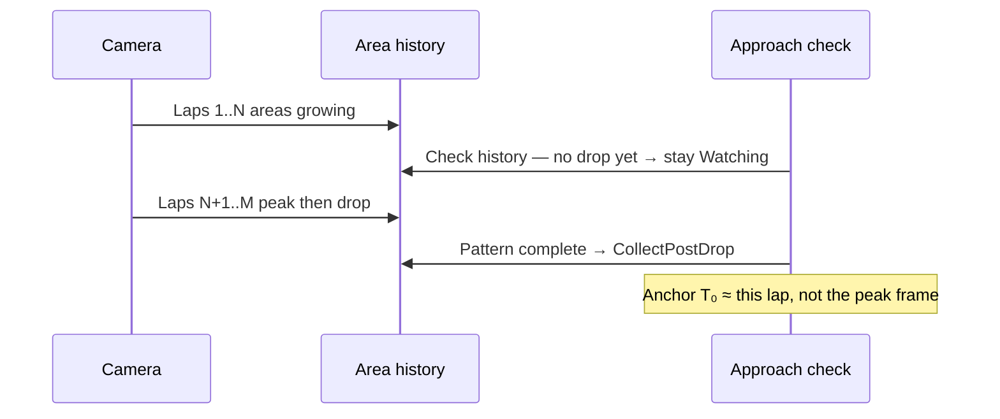
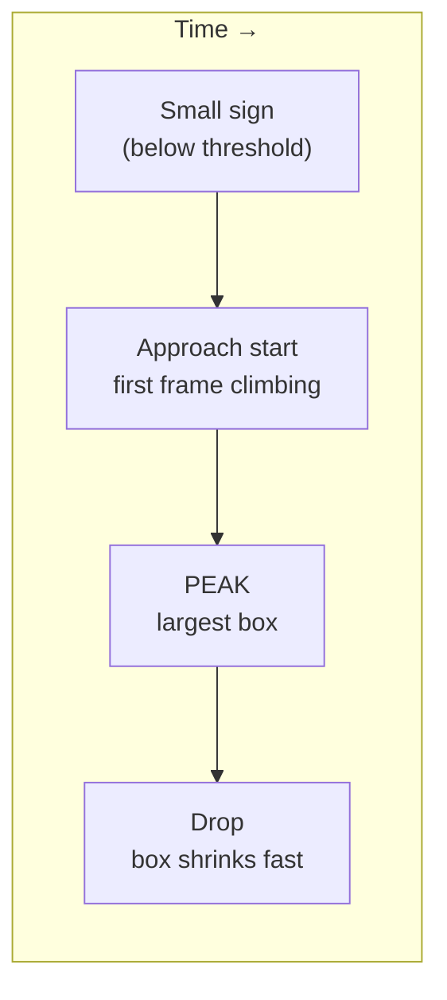
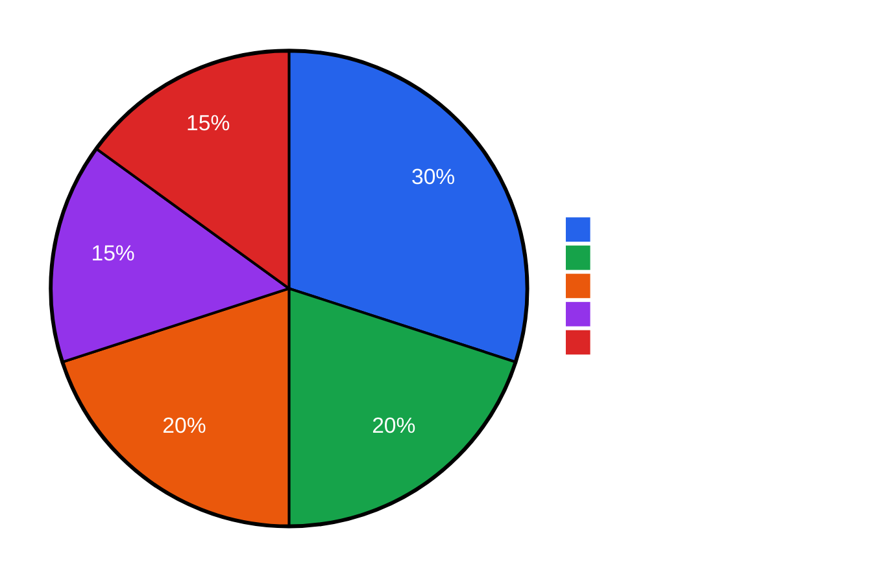
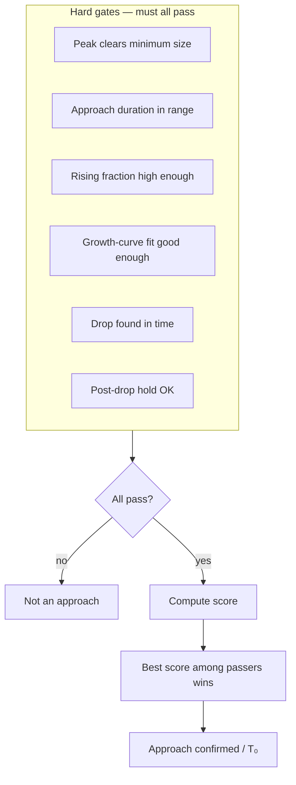

# Event Detection (Safe & Unsafe)

How the dashcam decides “that was a stop-sign encounter” and labels it **complete stop**, **rolling stop**, or **run-through**. How clips get saved and beeps fire is in [event_clip_pipeline.md](event_clip_pipeline.md).

---

## 1. Purpose

Identify **stop-sign encounters** in dashcam video and classify driver behavior in two layers:

| Layer | Outcome | Meaning |
|-------|---------|---------|
| **Safe** | Complete stop | Vehicle fully stopped at the sign |
| **Unsafe** | Did not fully stop | Parent for the two subtypes below |
| ↳ **Rolling stop** | Slowed but did not stop | Crept through without a true stop |
| ↳ **Run-through** | Did not slow enough | Treated the sign more like a yield / ignore |

When an encounter finishes, emit a **driving event** (a labeled outcome the rest of the app can act on) so the clip pipeline can save evidence and (for unsafe) beep. Classification is layered: first **safe vs unsafe**, then (if unsafe) **rolling vs run-through**.

---

## 2. MVP assumptions

- No car queued directly in front of the driver.
- **One stop sign per encounter** — not two visible signs on the same road separated by distance. Classification expects approach-then-drop: after you pass the sign it leaves the frame and box area falls to ~0; if that pattern does not match, classification can fail or misfire.
- Stop sign remains **mostly visible** through the approach.
- After closest approach, the box shrinking is normal — **do not** abandon the encounter just because the sign briefly disappears from detection.
- **Video-only motion** (how the road texture moves in the image); no GPS/IMU for MVP. Extra motion in the road ROI (e.g. a crossing vehicle while fully stopped) can falsely look like continued travel and trigger an unsafe label.
- Fixed dashcam mount; thresholds are tunable in config.
- System will only be used in North America where people drive on the right side of the road.

High-level product limitations (FPS, recording gaps, heat, ROI false positives) are summarized in the repo [`README.md`](../../README.md) (collapsible **Limitations** section).

### Terms used below

| Term | Plain English |
|------|----------------|
| **Lap** | One pass through the capture loop: grab a frame, (when idle) run detection, then **`observe`** (and **`evaluate`** when ready). |
| **Idle** | Not currently writing an event clip; detection and event logic still run. |
| **Event evaluator** | The logic that owns area/motion history and decides when to emit a driving event. |
| **Bounding-box area** | How large the stop-sign rectangle is in the frame (fraction of the image). |
| **Area history** | Rolling log of recent stop-sign box sizes (not the video clip buffer). Grow → peak → shrink is the approach pattern. |
| **Motion history** | Rolling log of “how much is the road moving?” scores, kept only after an approach is confirmed. |
| **Approach-then-drop** | Pattern: box grows as you near the sign, peaks near closest approach, then shrinks as you pass. |
| **Watching** | State: still looking for the approach-then-drop pattern. Record box size each lap; do **not** score road motion yet. |
| **CollectPostDrop** | State: approach already confirmed. Sample road motion for a few seconds, then classify and emit. |
| **Anchor (T₀)** | The clock time we freeze when approach-then-drop is first confirmed — start of the post-drop window. |
| **Latch the anchor** | Record T₀ once and keep it; later steps measure “how long since T₀,” not a moving target. |
| **Post-drop window** | Fixed seconds **after** T₀ during which we sample motion to judge the stop (**5 seconds** in the chosen settings). |
| **Motion sample** | One “how much is the road moving?” score for the current frame (optical flow in a road ROI). |
| **Road ROI** | Region of interest — the part of the frame (lower/middle road band) where we measure motion, not the whole image. |
| **Classifier (kNN)** | A nearest-neighbor model trained offline, saved to a small file the Pi loads at startup. At run time it only sees a few numbers for the current encounter — not the original training clips. |

---

## 3. State diagram (user-facing)

**Monitoring** (high-level rest state) = waiting between encounters. When **approach-then-drop** (grow → peak → shrink of the stop-sign box) is recognized, we judge post-drop road motion as safe or unsafe (and which unsafe subtype).

### 3.1 Implementation states

Under the hood there are two working phases (same story as Monitoring → ApproachStopSign above):

| State | Role |
|-------|------|
| **Watching** | Idle and still hunting for an approach. Every idle lap: record the largest stop-sign box size into **area history**, then check for **approach-then-drop**. No road-motion scoring. No “N hits in a row” gate. No retry timer. |
| **CollectPostDrop** | Approach already found. **Latch the anchor** (store T₀). Freeze area history. Each lap: take **one motion sample** until the **post-drop window** after T₀ ends. Then classify → emit a driving event → clear histories → back to **Watching**. Brief sign loss is ignored here. |

We check for the approach pattern **every idle lap** on the area history collected so far (no “wait for N sign hits,” no retry timer). An older design that used those gates is out of scope here.

**Clip timing:** Approach checks and post-drop motion sampling happen while still **idle** (not yet writing an event clip). A **driving event is only emitted when the post-drop window finishes** — not at the moment approach is first confirmed (T₀). Only then may the capture loop start a clip. Pre-roll (recent camera frames kept for video) already includes those idle frames, including the roughly 5-second post-drop window; the clip does **not** begin at T₀.

### 3.2 Ownership — histories live with the event evaluator

| Store | Who owns it | What it holds | How long it lasts |
|-------|-------------|----------------|-------------------|
| **Area history** | Event evaluator | Timestamp + largest stop-sign box size each lap | Rolling window of about 15–20 seconds (long enough for a full approach). Not part of the clip video buffer. |
| **Motion history** | Event evaluator | Timestamp + motion score | Only during **CollectPostDrop**; about 5 seconds. Cleared when we emit or reset. |
| **Previous frame** | Event evaluator | Last camera frame needed to compare motion | One frame; refreshed each CollectPostDrop lap. |

Saving video for a clip and judging the stop are different jobs, so those histories are **not** stuffed into the video frames.

### 3.3 What runs each lap

Each **idle** lap (see [event_clip_pipeline.md](event_clip_pipeline.md) §4): capture a frame → **if Watching**, run the detector and attach detections → **`EventManager.observe(pre_buffer)`** (collect only). After approach latch (**CollectPostDrop**), skip the detector; only camera + motion collection run. When **`ready_to_evaluate`**, **`EventManager.evaluate()`** classifies and always returns a **`DrivingEvent`** (never **`None`**). While a clip is being written, detection and observe/evaluate are skipped.

**`observe`** must stay **cheap per lap** (milliseconds). One new frame per call: update short **area history** / **motion history** in memory; at most **one** optical-flow step (CollectPostDrop only — comparing this frame to the previous one in the road ROI). Do not reopen video files inside observe. **`evaluate`** runs only at window end (features + kNN).

| Work item | Watching (every lap) | CollectPostDrop (every lap) | When the window ends |
|-----------|----------------------|-----------------------------|----------------------|
| Camera | yes (idle only) | yes (idle only) | — |
| Detector (TPU) | **yes** | **no** | — |
| **`observe`** | yes → area history + approach check | yes → motion sample | — |
| Record box size | yes → area history | no (freeze that history) | — |
| Check approach-then-drop | **yes, every lap** on full area history | no | — |
| Record motion sample | no | yes → motion history | — |
| **`evaluate`** (classify stop quality) | — | — | yes → emit **`DrivingEvent`** |

---

## 4. Outcome pipeline

Each encounter is built in stages. Later stages only run if earlier ones succeeded.

| Stage | What it decides |
|-------|-----------------|
| 1 Detection | Enough usable stop-sign boxes in area history |
| 2 Approach | Grow → peak → drop confirmed |
| 3 Safe vs unsafe | Post-drop motion looks like a full stop or not |
| 4 Rolling vs run-through | If unsafe, which subtype |
| 5 Driving event | One emitted outcome when evaluate runs: complete stop, rolling, or run-through |

Stage 5 is **not** a fourth model — it is approach detection plus the two classifiers, composed into one driving-event label. Laps with no approach latch never call **`evaluate`** (no event that lap).

While in **Watching** (idle, still looking for an approach — not yet collecting post-drop motion), the system may detect approach on **every idle lap** from the area history so far — no “sign hits in a row” gate first.

---

## 5. Transition definitions (conceptual)

| Transition | Rule |
|------------|------|
| **Watching → Watching** | Still hunting: area history does not yet show approach-then-drop. |
| **Watching → CollectPostDrop** | Approach-then-drop confirmed; **latch the anchor** (store that moment as T₀ — start of the motion window). |
| **CollectPostDrop → Watching** | Post-drop window finished (enough time after T₀); classify; emit driving event; clear histories; go back to hunting. |

---

## 6. Approach detection algorithm

This section describes the logic that searches for the approach pattern. The detection of the approach pattern indicates that the car is getting closer to a stop sign that the driver must stop at. This pattern is used to differentiate between footage of normal driving where nothing relevant is occuring and footage where we expect the driver to fully stop the vehicle. This helps us prevent the misfiring of stop sign events when not relevant.

### 6.1 The idea in one sentence

As you drive toward a stop sign, the sign’s bounding box in the camera **gets bigger**, hits a **peak** when you are closest, then **shrinks** to 0 area when you the stop sign goes out of frame. The algorithm looks for that **grow → peak → drop** shape in the box size over time.

You do **not** need GPS or speed data for this step — only **how large the detected stop-sign box is each frame**.

### 6.2 What we measure each frame

Every frame, object detection may draw a rectangle around a stop sign. We take the **best** stop-sign box and multiply its width by its height.

Width and height are fractions of the full frame (0 to 1), so the product is the **fraction of the camera image covered by the box**.

We often show that as a **percent of frame area** (multiply by 100):

| Stored fraction | As percent | Plain English |
|-----------------|------------|---------------|
| 0.0025 | 0.25% | sign covers a quarter of one percent of the frame |
| 0.02 | 2% | sign covers 2% of the frame |
| 0.03 | 3% | sign is quite large in view |

This is **not** “pixel count squared.” A 20×20 pixel box can be tiny or large as a share of the frame depending on camera resolution.

Over time we build an **area history** — one size per lap — and search it for the grow-peak-drop pattern.

### 6.3 End-to-end flow

**On the Pi:** each idle lap appends one area sample, then reruns the check on **all samples collected so far**. Detection fires the first time that history contains a complete grow → peak → drop pattern — usually **after** the drop, not at the physical peak. That fire time is T₀ (the anchor).

### 6.4 Growing history (each lap)

Each lap asks: *“Looking only at the area history so far, is there already a full grow → peak → drop story?”*

| After lap | History contains |
|-----------|------------------|
| Lap 5 | samples 0 … 5 |
| Lap 20 | samples 0 … 20 |

Early history fails (peak or drop not seen yet). Once the drop is in the buffer, detection can fire — typically a few tenths of a second **after** the closest approach.

### 6.5 Step-by-step on one peak

For each **peak candidate** (a frame where the box was locally largest and big enough), the algorithm runs five checks.

#### 6.5.1 Find peak candidates

1. **Local peaks:** a frame larger than its neighbors, and at least as large as the **minimum peak size** (0.25% of the frame in the chosen settings).
2. **Global maximum:** the largest frame in the series (if it also clears that minimum), even if it is the last frame.

Candidates are tried **largest peak first**. Every candidate is tested; among those that pass every check, the **highest ranking score** wins (see §6.8). There is **no minimum score to pass** — the score only breaks ties among passers.

#### 6.5.2 Define the “approach start” (walk backward from peak)

From the peak, walk **backward in time** until the box shrinks to a small fraction of the peak — **10% of the peak** in the chosen settings.

The frame **after** that low point is **approach start** — the first frame climbing up from “small sign.”

**Example:** peak = 0.30% of frame → walk-back cutoff = 0.03% (10% of peak).  
Walking back, frame 1 has 0% (at or below 0.03%) → approach starts at **frame 2** (the frame after the low), not frame 1.

#### 6.5.3 Approach leg must look like “driving toward”

| Check | Chosen rule | Meaning |
|-------|-------------|---------|
| **Duration** | 0.35–12 seconds | Time from approach start → peak must sit in that band. |
| **Rising fraction** | at least half of sampled steps go up | Enough upward steps (sampled ~10 times per second to ignore jitter). |
| **Growth-curve fit** | fit quality at least 0.3 (on a 0–1 scale) | Size vs time should look like steady growth toward the sign (closer often grows faster). |

Duration is estimated from **how many frames passed ÷ camera frame rate**, not from a wall-clock stopwatch (see §6.9).

#### 6.5.4 Drop after peak

After the peak, within **2.5 seconds**, find the first frame where the box has fallen to **12% of the peak size or less** — a sharp shrink, not a gentle fade.

#### 6.5.5 Post-drop hold

For a very short hold after that drop frame (**50 ms** in the chosen settings), the box must stay below a loose multiple of the peak (**2.5× peak** by default). That rejects one-frame glitches. The main work is confirming the drop frame itself exists.

### 6.6 Worked example (numbers)

Assume **10 frames per second** and the chosen approach settings. Sizes as **percent of frame**:

| Frame | Time (s) | Area (%) |
|-------|----------|----------|
| 0–1 | 0.0–0.1 | 0 |
| 2 | 0.2 | 0.05 |
| 3 | 0.3 | 0.10 |
| 4 | 0.4 | 0.15 |
| 5 | 0.5 | 0.20 |
| 6 | 0.6 | 0.25 |
| **7** | **0.7** | **0.30** ← peak |
| 8 | 0.8 | 0.02 |
| 9 | 0.9 | 0.01 |

| Step | Result |
|------|--------|
| Peak candidate? | 0.30% clears the 0.25% minimum ✓ |
| Approach start | Walk back: frame 1 = 0% ≤ 0.03% → start **frame 2** |
| Approach duration | (7 − 2) / 10 = **0.5 s** (within 0.35–12 s) ✓ |
| Drop | Frame 8: 0.02% ≤ 0.036% (12% of the 0.30% peak) ✓ |
| When we fire live | History through frame 8 or 9 → **T₀ ≈ 0.8–0.9 s** (anchor = approach confirmed, not the peak frame) |

After T₀, we enter **CollectPostDrop**: collect road motion for ~5 seconds, then run stop-quality classification (see §7–§8).

### 6.7 Chosen approach settings

The numbers below are the approach rules we settled on after offline testing on labeled clips — the same rules the Pi uses at runtime (`approach_config.json`). A longer reference with matching values (and how they were chosen) is here: [ap_050_config_reference.md](ap_050_config_reference.md). Runtime file grouping: §9.

#### Peak gate

| Setting | Value | Plain English |
|---------|-------|---------------|
| Minimum peak size | 0.25% of frame | Sign must get at least this large at peak to count. Filters distant noise. |

#### Approach leg (growth)

| Setting | Value | Plain English |
|---------|-------|---------------|
| Minimum approach duration | 0.35 s | Approach must last at least this long (not an instant spike). |
| Maximum approach duration | 12.0 s | Approach cannot grow longer than this. |
| Approach-start walk-back | 10% of peak | Walk back until size ≤ this share of the peak; next frame = approach start. |
| Minimum rising fraction | 0.5 | At least half of sampled steps must go up. |
| Minimum growth-curve fit | 0.3 | Growth curve quality floor (0–1). |

#### Drop leg (shrink)

| Setting | Value | Plain English |
|---------|-------|---------------|
| Drop deadline after peak | 2.5 s | Drop must happen within this long after peak. |
| Drop depth | 12% of peak | Drop ends when size falls to this share of the peak or less. |
| Post-drop hold | 50 ms | Stay low for this brief hold after drop. |
| Hold ceiling vs peak | 2.5× peak | During hold, size must stay at or below this multiple of the peak (loose by default). |

The Pi approach checker runs on the **raw** area history only. There is **no** gap-fill / envelope re-try pass in edge config or runtime code (`approach_config.json` / `approach/detect.py`). Older offline analysis scripts may still expose those knobs for experiments; they are not part of the product detector.

### 6.8 Scoring (ranking only — not pass/fail)

If **multiple peaks** pass all hard checks, one winner is picked by a **weighted score**. There is **no score threshold** — passing checks is enough to count as “approach occurred.” The score only ranks winners.

| Term | Weight | Color in diagram | How it is computed |
|------|--------|------------------|-------------------|
| Growth-curve fit | 30% | Blue | Fit quality on a 0–1 scale, used directly. |
| Rising fraction | 20% | Green | Share of upward steps (0–1), used directly. |
| Peak size | 20% | Orange | Peaks at or above **3% of frame** get full credit; smaller peaks get proportionally less. |
| Approach duration | 15% | Purple | Longer approaches score higher, capped at about 4 seconds. |
| Drop speed | 15% | Red | Faster drop within the 2.5 s deadline scores higher. |

**Example:** a 0.25% peak is only about one-twelfth of the 3% “full credit” size, so the peak-size term is small (~0.083 on a 0–1 scale) and contributes roughly **0.017** to the total score (not the full 20%).

Every passing candidate gets its **own** score; the **maximum** wins. Failed candidates do not compete.

### 6.9 Design choices worth knowing

#### Retrospective on live video

Detection is **not** “sign is biggest right now.” It waits until the history proves **growth, peak, and drop**. That adds a small delay after closest approach but reduces false triggers.

#### Frame count vs wall-clock time

Durations are estimated as **frames elapsed ÷ frame rate**. On the Pi, frame rate comes from how many capture laps finished over wall time. Variable frame rate or loop jitter can make this differ slightly from a stopwatch.

#### One maneuver per CollectPostDrop cycle

After approach is confirmed and the post-drop window finishes (classify + emit), clear area and motion history and return to **Watching** (hunting again) so the same samples cannot re-trigger.

### 6.10 Pass/fail vs ranking (summary)

---

## 7. Motion score

Video-only answer to “is the car still moving?” during **CollectPostDrop** only (approach already confirmed; we are in the seconds after T₀). **Watching** (still hunting for an approach) does **not** run optical flow.

1. Compare consecutive frames with optical flow (how pixels shift in the image).
2. Look mainly at a **road ROI** (region of interest — lower/middle road band, not the whole frame).
3. Summarize motion strength in that region (for example a high percentile of how far pixels moved).
4. Smooth over a short run of frames so one noisy frame does not dominate.

### 7.1 Chosen motion / window settings

| Setting | Value | Plain English |
|---------|-------|---------------|
| Post-drop window | **5.0 s** | How long after T₀ (the moment approach was confirmed) we keep collecting motion before classifying |
| Stopped threshold | **0.6** | **Motion scores** at or below this count as “stopped” when measuring stop fraction |
| Road ROI | middle 50% width × lower band (about 55–95% down the frame) | Where in the frame we measure road motion |
| Optical-flow detail | fixed comparison settings from the chosen offline run | How finely consecutive frames are compared when estimating motion (pyramid levels, window size, and related knobs) |
| Flow downscale | 0.5 | Shrink the image to half size before measuring flow — cheaper and usually good enough for a road-texture signal |
| Motion smooth window | 5 frames | Short running average of **recent motion scores** so a single noisy frame matters less |

Matching tables and notes: [ap_050_config_reference.md](ap_050_config_reference.md).

### 7.2 Numbers fed to the classifier (§8)

**Stage 1 (safe vs unsafe)** — motion-only summaries from the post-drop window:

| Number | Meaning |
|--------|---------|
| Mean motion | Average road movement in the 5 s window |
| Min motion | Quietest moment in the window (closest to stopped) |
| High-percentile motion (95th) | How strong motion still gets in the noisier part of the window |
| Stop fraction | Share of **motion samples** at or below the stopped threshold (0.6) |

**Stage 2 (rolling vs run-through, unsafe only)** — one motion number plus one area number:

| Number | Meaning |
|--------|---------|
| Min motion | Same quietest-moment score as in stage 1 |
| Approach area sum | Sum of sign size (percent of frame) from approach start through the drop — taken from the **area history** that produced T₀ |

Area history therefore supports **approach detection** and that one stage-2 number — not stage 1.

---

## 8. Stop-quality classification (training vs runtime)

### 8.1 The idea

Offline, we label clips and tune approach + a 5-second post-drop motion window, then train two nearest-neighbor stages (compare this encounter’s numbers to labeled past encounters). On the Pi we only **run** those saved models — we do not retrain or keep the training clips.

### 8.2 Training stays offline; the Pi loads a saved model

| Phase | Where | What happens |
|-------|-------|--------------|
| **Train** | Offline analysis on labeled clips | Fit stage-1 and stage-2 nearest-neighbor models from feature numbers + ground truth |
| **Export** | Once per chosen settings set | Save each fitted model to a small file on disk |
| **Runtime** | Raspberry Pi | At startup, **load** those files. For each encounter, compute a few numbers and ask the model for a label. No training set, clip cache, or spreadsheets on the device |

Settings store **where the model files live**, which feature numbers go in which order, and how many neighbors to compare against — so we can reproduce a run and catch mismatched vector shapes. They do **not** store the training rows.

### 8.3 Two stages → one driving-event label

| Stage | Decision | Numbers used | Neighbors (chosen) |
|-------|----------|--------------|--------------------|
| 1 | Safe vs unsafe | Mean, min, 95th percentile, stop fraction | 3 |
| 2 | Rolling vs run-through (only if unsafe) | Min motion + approach area sum | 3 |

**How labels combine:**

- Stage 1 says complete stop → emit **complete stop** (safe)
- Stage 1 says unsafe → stage 2 chooses **rolling stop** or **run-through**

### 8.4 Software pieces (implemented)

Wired by `build_event_manager` / `build_pipeline`. Paths under `src/main/edge/`; tree markers: [directory_tree.md](directory_tree.md).

| Piece | Module | Job |
|-------|--------|-----|
| Approach checker | `netrapi/events/approach/detect.py` | Grow → peak → drop on the area history (Watching) |
| Motion scorer | `netrapi/events/classify/motion_score.py` | One optical-flow sample per CollectPostDrop lap (road ROI) |
| Feature builder | `netrapi/events/classify/features.py` | Turn motion + area histories into the stage-1 / stage-2 number lists |
| Stop classifier | `netrapi/events/classify/stop_classifier.py` | Load the saved joblib models; map those numbers to complete / rolling / run-through |
| Event evaluator | `netrapi/events/event_manager.py` | Holds state and histories; runs the steps above each idle lap; emits a driving event when the post-drop window ends |

---

## 9. Configuration (runtime layout)

Loaded via `AppConfig` from `src/main/edge/config/`. Typed settings live in `config/types.py`. Capture/clip wiring: [event_clip_pipeline.md](event_clip_pipeline.md) §6; file tree: [directory_tree.md](directory_tree.md).

| Settings group | JSON file | Role |
|----------------|-----------|------|
| Detector | `detector.json` | Edge TPU TFLite model / labels paths, input shape, score threshold, allowed classes |
| Event evaluator | `event_manager.json` | Which detector labels count as a stop sign; how long to keep area history |
| Approach | `approach_config.json` | Grow → peak → drop thresholds (same as §6.7) |
| Motion | `motion_config.json` | Road ROI, Farneback / flow options, stopped threshold, post-drop window length, motion smooth window |
| Stop classifiers | `knn_config.json` | Neighbor count, ordered feature lists, and **paths to the saved model files** for each stage |

| Saved model files | Path (repo-relative) | Role |
|-------------------|----------------------|------|
| Detector model | `src/main/edge/models/ssdlite_mobiledet_coco_qat_postprocess_edgetpu.tflite` | Edge TPU stop-sign detector (from `detector.json` → `model_path`) |
| Detector labels | `src/main/edge/models/coco_labels.txt` | COCO class names for the detector (from `detector.json` → `labels_path`) |
| Stage-1 model | `src/main/edge/models/knn_stage1.joblib` | Saved safe-vs-unsafe nearest-neighbor model |
| Stage-2 model | `src/main/edge/models/knn_stage2.joblib` | Saved rolling-vs-run-through nearest-neighbor model |

While **Watching** (still hunting for an approach), approach is checked **every idle lap** on the area history so far. There is **no** separate “sign hits in a row” gate and **no** approach retry timer.

---

## 10. Related docs

- [event_clip_pipeline.md](event_clip_pipeline.md) — capture loop, idle vs clip, when events can fire
- [ap_050_config_reference.md](ap_050_config_reference.md) — full chosen numbers for approach / motion / classification (offline analysis trail)
- [directory_tree.md](directory_tree.md) — config files, modules, and model artifacts on disk
