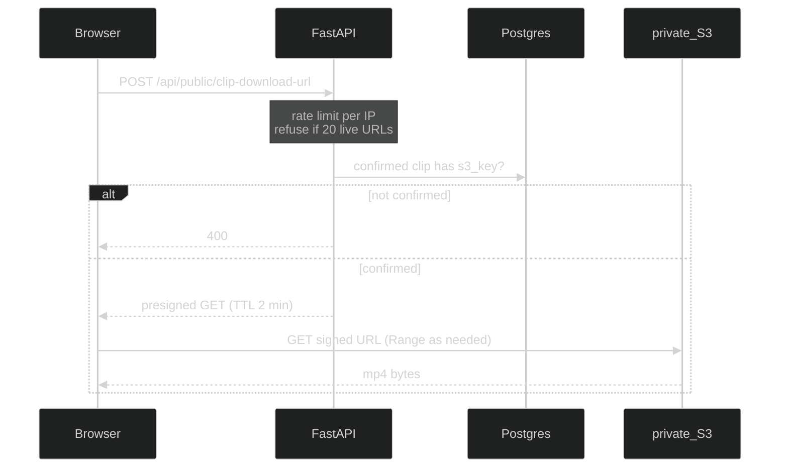

# Frontend clip playback

How the public site plays stop-sign event clips from a **private** S3 bucket — without putting AWS or device keys in the browser, and without treating CORS as authentication.

Pi ingest (`POST /api/netrapi/s3-download-url` with `X-API-Key`) stays in [backend_api.md](backend_api.md). Cloud stores and credentials stay in [cloud_architecture.md](cloud_architecture.md). This file is the **visitor playback** design only.

> **Tip:** Zoom the Markdown preview (Ctrl/Cmd + mouse wheel) or open this file on GitHub full-width. Diagrams use a dark theme for readability.

**Document map**

| Section | Contents |
|---------|----------|
| [§1 The problem](#1-the-problem) | What a visitor needs, and what we will not ship |
| [§2 How a clip plays](#2-how-a-clip-plays) | Browser → mint → S3 |
| [§3 Three limits](#3-three-limits) | Per-IP rate, 20 live URLs, 2-minute TTL |
| [§4 Ingest vs public mint](#4-ingest-vs-public-mint) | Device key stays off the website |
| [§5 CORS](#5-cors) | Browser-only; not proof of the UI |
| [§6 Rejected options](#6-rejected-options) | Keys in Vite, baked URLs, public bucket |
| [§7 Status](#7-status) | What is built |
| [§8 Related](#8-related) | Specs and neighboring diagrams |

---

## 1. The problem

The portfolio site has a **Try it out** table of confirmed events. A visitor should be able to click a row and watch that clip.

Constraints:

- The S3 bucket stays **private**. Unsigned `GET` of an object key fails.
- The browser never holds AWS keys or the Pi ingest key (`NETRAPI_API_KEY`). Built JavaScript is public.
- Video bytes go **browser ↔ S3**. FastAPI only mints a short-lived GET URL (same pattern as ingest: the API never proxies MP4s).
- Anyone can call a public mint with `curl`. That is fine if the URL dies quickly and we do not hand out an unbounded number of live signatures.

We cannot make a presigned S3 URL “one GET then dead.” S3 expires signatures on a **clock**, not after first use. HTML5 `<video>` also issues several Range requests against the **same** URL; that is normal playback, not extra mints.

---

## 2. How a clip plays

Click a table row → POST that row’s Postgres `clip.id` to `POST /api/public/clip-download-url` (no API key) → set `<video src>` to the returned URL. The table debounces row selection and reuses an unexpired minted URL so click-through does not burn the per-IP rate or live-slot caps. The table is filled only by `GET /api/public/clips` (confirmed clips in cloud Postgres). There is no sample/dummy table.

Only **confirmed** clips mint: `s3_stored` true and `s3_key` set, otherwise 400 — same rule as ingest download.

---

## 3. Three limits

All three apply to the **public** mint only. Pi ingest is unchanged (clip GET still 15 minutes).

| Control | What it caps | Why |
| ------- | ------------ | --- |
| **Per-IP rate limit** | How often one client can **ask** for a new URL | **10 POSTs per 60 seconds** per IP. Stops a scraper from minting as fast as TCP allows. Orthogonal to the slot cap. |
| **20 live URLs** | How many **unexpired** public GET signatures exist at once (global) | FastAPI counts mints whose 2-minute TTL has not elapsed. The 21st mint is **429** until a slot ages out. Slots are time-based; S3 does not report “used.” |
| **2-minute TTL** | How long each signature works at S3 | `ExpiresIn = 120`. After two minutes S3 rejects the URL. A `<video>` player may issue several Range GETs on **one** URL; that does not consume extra slots. |

Together: the bucket stays private, a leaked URL is short-lived, and the site cannot have an unbounded set of valid GET signatures at once. Rapid minting is expensive; scrape is not impossible. The rate and slot counters live in the FastAPI process (typical Render starter: one worker).

---

## 4. Ingest vs public mint

Two HTTP surfaces. They must not share the device key.

| Surface | Who | Auth | What it can do |
| ------- | --- | ---- | -------------- |
| `/api/netrapi/*` | Raspberry Pi | `X-API-Key` (`NETRAPI_API_KEY`) | Session, event, upload URL, confirm, **ingest** download URL, local-delete |
| `/api/public/*` | Vite / Vercel visitor | none for this demo | **GET URL only** — `POST /api/public/clip-download-url`, `GET /api/public/clips`. No PUT, confirm, or delete |

Do **not** put `NETRAPI_API_KEY` in `VITE_*`. The built JS ships to every visitor.

`Authorization: Bearer` is reserved for a later frontend JWT so it does not collide with the Pi header. JWT is **not** required for this public demo. Ingest already mints the same class of GET URL (`presign_get`); a public router can call that helper without sharing the ingest key.

---

## 5. CORS

Allow `http://localhost:5173` and `http://127.0.0.1:5173` by default. On Render, set `CORS_ORIGINS` to include the Vercel origin so **other websites’ JavaScript** cannot read the mint response in a visitor’s browser.

CORS is a **browser** rule. `curl` ignores it. A matching `Origin` header is trivial to spoof. “The request must come from our UI” is not something HTTP can prove. DevTools → Copy as cURL is the same POST the page makes.

Use CORS anyway. Do not treat it as authentication. The limits in [§3](#3-three-limits) are what bound anonymous minting.

---

## 6. Rejected options

| Idea | Why not |
| ---- | ------- |
| Ingest key (or `VITE_API_KEY`) in the SPA | Leaks device upload, confirm, and delete on the public site. |
| Bake presigned URLs into the frontend build | Public mint TTL is 2 minutes; a baked URL would be dead (or we’d have to lengthen TTL and ship long-lived links). |
| Public S3 bucket | Unsigned GET would work. The bucket is private by design. |
| “Only Vercel, because we check Origin” | Origin is not proof of the UI. See [§5](#5-cors). |

---

## 7. Status

Implemented:

- `POST /api/public/clip-download-url` — 2-minute GET, 20 live slots, 10 mints/minute/IP
- `GET /api/public/clips` — confirmed clips for the Try it out table
- CORS for `http://localhost:5173` and `http://127.0.0.1:5173` (add the Vercel origin via `CORS_ORIGINS` on Render)
- Try it out click-to-play (`VITE_API_URL` on Vercel; Vite proxies `/api` to local FastAPI)
- Public mint inlines `areas`/`motion`/`transitions` JSON (one live slot for the MP4). Try it out detailed analysis is the default; simple video-only remains available. Detailed playback uses native HTML5 controls with seeking disabled.

Not in this pass:

- JWT / Google login
- Filter/search beyond the confirmed-clip list

---

## 8. Related

| Item | Role |
| ---- | ---- |
| [backend_api.md](backend_api.md) | Pi ingest, including authenticated `s3-download-url` |
| [cloud_architecture.md](cloud_architecture.md) | Private S3, credentials, who talks to whom |
| [mvs.md](../specs/mvs.md) M-7.13, M-7.14, M-9.22 | Signed URLs and frontend playback requirements |
| Decision 46 | Pi `X-API-Key`; `Authorization` free for later JWT |
| Decision 50 | Ingest download mint; frontend can reuse `presign_get` later |
| TP-46 | Unsigned object GET fails; signed GET succeeds |
| `s3.py` | Ingest clip mint: 15 minutes. Public mint: `PUBLIC_CLIP_EXPIRES_SECONDS = 120`. |
| `public_limits.py` | 10 mints / 60 s / IP; max 20 live public URLs |
