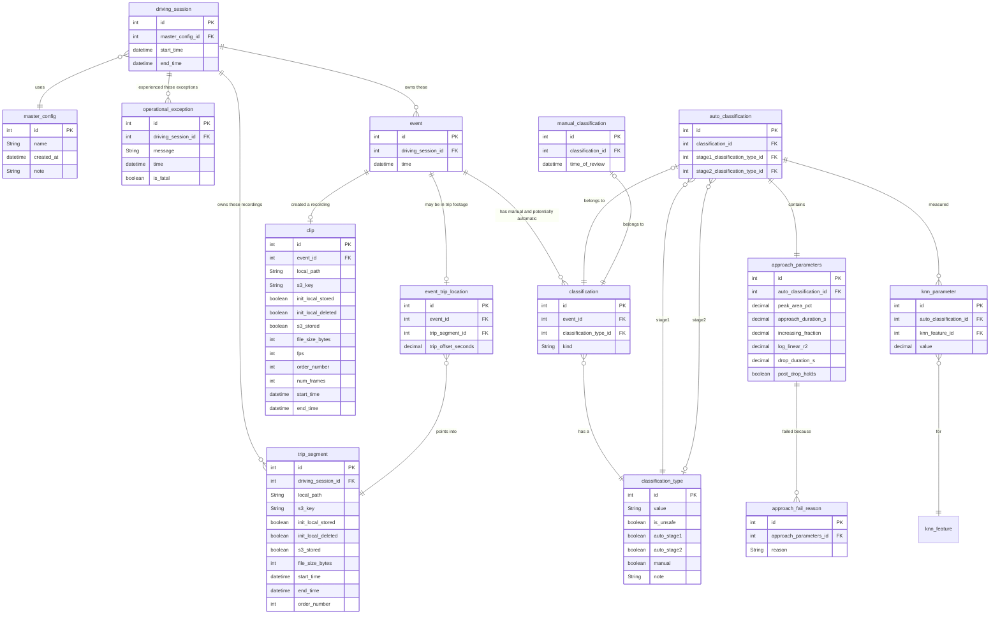

# Schema design

Target ER for edge/cloud event metadata. Open constraints and review-time behavior live here so the diagram does not over-promise. The three databases (Pi SQLite local prod, Compose Postgres test-only, Supabase cloud prod), credentials, Compose vs Render, and Alembic apply steps live in [cloud_architecture.md](cloud_architecture.md).

## Information Requirements

- I want to retrieve the clip file after storing it inside the S3 bucket
- I want to know whether a clip or trip file is still on the Pi, in S3 (local copy may still exist), or in S3 with the local copy deleted
- I want to browse events and see when they happened and what type they are
- I want to filter events by date range and type (complete stop, rolling stop, run-through, false positive, false negative)
- I want to play a clip in the frontend using a signed URL
- I want to see the model's label next to my manual label and tell if they agree
- I want overall and per-class accuracy after I finish review (including false positives and false negatives)
- I want stage-1 and stage-2 kNN accuracy, not just the final label
- I want to find false negatives (missed events) and false positives from the type list
- I want counts of events per driving session
- I want to see which config a driving session used
- I want to jump to a moment in trip footage using the segment and offset

## Definition data

Lookup rows that do not change per session. Alembic revision `0002` inserts `classification_type` once, plus the initial `edge-json` config snapshot. Flags say which FKs may point at the row (`auto_stage1` / `auto_stage2` on `auto_classification`, `manual` on a manual `classification`).

| value | is_unsafe | auto_stage1 | auto_stage2 | manual | Purpose |
|---|---|---|---|---|---|
| `complete-stop` | no | yes | no | yes | Vehicle fully stopped. Also the auto **final** label when stage 1 is complete-stop. |
| `rolling-stop` | yes | no | yes | yes | Slowed but did not stop. Also the auto **final** label when stage 2 picks this. |
| `run-through` | yes | no | yes | yes | Did not stop / treated as a yield. Also the auto **final** label when stage 2 picks this. |
| `rolling-or-run-through` | yes | yes | no | no | Unsafe bucket before stage 2. Not a review label and not a frontend filter. |
| `false_positive` | no | no | no | yes | Pipeline created an event, but review says this was not a stop-sign encounter. |
| `false_negative` | no | no | no | yes | Stop-sign encounter found in trip footage that the pipeline missed. Does not store which stop class was missed. |

## Limitations / things to keep in mind

### Classification lifecycle

`event` has **zero or more** `classification` rows: the pipeline writes an **auto** row immediately during a live driving session if a stop-sign related occurence is encountered (safe OR unsafe); **manual** is the ground-truth label added later. Live driving therefore has auto only. After review, a detected event has both rows; accuracy is comparing their `classification_type` FKs.

Each `classification` row is **exactly one** of auto or manual (`kind` is `auto` or `manual`; unique `(event_id, kind)`). At most one auto and one manual per event. “Every event eventually has a manual label” is a review-completeness rule, not a DB NOT NULL — otherwise the Pi cannot insert events while driving.

Approach pass/fail is whether `approach_fail_reason` has any rows for that `approach_parameters` (no stored `passed` flag).

### Media path (clip and trip_segment)

`init_local_stored`, `s3_stored`, and `init_local_deleted` default to **null**. Leave them null until that attempt finishes; do not pre-set `false` for a step that has not run yet.

`local_path` is the Pi file (null until a local write succeeds). `s3_key` is the object key (null until upload succeeds). Do not overload one `path` column.

Designed outcomes:

1. Row created, nothing finished yet → all three flags **null**, both paths null
2. Local write succeeds → `init_local_stored = true`; S3 flags still **null**; `local_path` = Pi file path; `file_size_bytes` = on-disk size when the file exists (clip at persist; trip when the segment is finished)
3. Local write fails → `init_local_stored = false`; S3 flags still **null**; `local_path` null
4. Upload to S3 succeeds → `s3_stored = true`, `s3_key` = S3 key on **both** Postgres (via `confirm-s3-upload`) and Pi SQLite (via `CloudIngest` after confirm). Clips confirm during the drive; trip files confirm in the Wi‑Fi drain. Postgres `file_size_bytes` from S3 `ContentLength`; `init_local_deleted` still **false**/null (local file still on the Pi)
5. Local delete succeeds → `init_local_deleted = true`; `local_path` cleared. Edge jobs: `--delete-uploaded` (only if `s3_stored` is true) or `--delete-all`. Cloud flags via `POST /confirm-local-delete`; S3 objects stay.
6. Upload to S3 fails → `s3_stored = false`; `init_local_deleted` stays **null**; `s3_key` stays null

S3 success and local delete are separate attempts. Frontend playback uses `s3_key` when `s3_stored` is true (signed URL). Still needs uploading: `init_local_stored = true` and `s3_stored` is null or false. Still needs local cleanup: `s3_stored = true` and `init_local_deleted` is false.

Same flags on `trip_segment` for full-session files.

### kNN stages

`classification.classification_type_id` is the **final** label (complete stop, rolling stop, run-through). `auto_classification` also stores the two kNN steps:

- `stage1_classification_type_id` — always set: `complete-stop` or `rolling-or-run-through`
- `stage2_classification_type_id` — set only when stage 1 is `rolling-or-run-through`: `rolling-stop` or `run-through`

`classification_type` flags decide which FKs are allowed: stage 1 → `auto_stage1`, stage 2 → `auto_stage2`, manual review → `manual`. Frontend filters use `manual = true`.

### Missed events

Creating `event` + `manual_classification` with type `false_negative` from trip review is the right model. Do **not** insert `auto_classification`. Tie that row to footage or you cannot replay it:

- require `trip_segment` (an `event_trip_location` row; live events without trip footage omit this table)
- store offset into the segment (`trip_offset_seconds`) so we can easily find corresponding clips from trip footage
- cut a clip from the trip file, upload to S3, and insert `clip`

A miss is therefore: manual type `false_negative` (and: clip + no auto class). Before scoring **overall accuracy**, finish trip-footage review: every miss must have its clip cut and a `clip` row populated.

## Operational schema

Table names avoid Python/SQLModel collisions: `driving_session` (not `session`, which clashes with `sqlmodel.Session`) and `operational_exception` (not `exception`, which clashes with builtin `Exception`). Python classes can match the tables (`DrivingSession`, `OperationalException`).

## Config schema

These config tables hold a frozen snapshot of the values a driving session used. Runtime settings still come from `src/main/edge/config` JSON via `AppConfig` (decision 58). List tables have unique business keys. Detector and event-manager class names share `object_label`. The active camera mode is `camera_config.selected_camera_mode_id` (FK to `camera_mode`), not a copied string.

A snapshot is immutable. Alembic `0002` seeds id 1 from frozen `src/main/edge/config` JSON. Before a driving session starts, the Pi fingerprints live JSON (not path-resolved `AppConfig`) and reuses an existing `master_config.id` when that fingerprint already exists; otherwise it inserts a new snapshot. See decision 56 and `POST /api/netrapi/master-config`.

```mermaid
erDiagram
    master_config ||--|| camera_config: "has"
    master_config ||--|| preview_config: "has"
    master_config ||--|| detector_config: "has"
    master_config ||--|| event_manager_config: "has"
    master_config ||--|| approach_config: "has"
    master_config ||--|| motion_config: "has"
    master_config ||--|| knn_config: "has"
    master_config ||--|| recording_manager_config: "has"
    master_config ||--|| trip_recorder_config: "has"
    master_config ||--|| buzzer_config: "has"
    master_config ||--|| health_config: "has"

    camera_config ||--|{ camera_mode: "offers"
    camera_config }o--|| camera_mode: "selected"
    detector_config ||--|{ detector_allowed_class: "filters"
    detector_allowed_class }o--|| object_label: "is"
    event_manager_config ||--|{ event_trigger_label: "triggers on"
    event_trigger_label }o--|| object_label: "is"
    knn_config ||--|{ knn_feature: "uses"
    motion_config ||--|| motion_roi: "measures in"
    motion_config ||--|| farneback_config: "uses"
    recording_manager_config ||--|| display_config: "renders with"

    master_config {
        int id PK
        String name
        datetime created_at
        String note
    }

    camera_config {
        int id PK
        int master_config_id FK
        String device
        int selected_camera_mode_id FK
        int ndim
        int channels
        String note
    }

    camera_mode {
        int id PK
        int camera_config_id FK
        String mode_key
        String label
        String input_format
        int width
        int height
        decimal spec_fps
        decimal recommended_fps
    }

    preview_config {
        int id PK
        int master_config_id FK
        String window_name
        int window_x
        int window_y
        int max_width
        int max_height
        boolean enabled
        String toggle_key
    }

    detector_config {
        int id PK
        int master_config_id FK
        String model_path
        String labels_path
        int input_width
        int input_height
        int channels
        String input_dtype
        decimal score_threshold
        int top_k
        String note
    }

    object_label {
        int id PK
        String value
    }

    detector_allowed_class {
        int id PK
        int detector_config_id FK
        int object_label_id FK
    }

    event_manager_config {
        int id PK
        int master_config_id FK
        decimal area_history_seconds
        String note
    }

    event_trigger_label {
        int id PK
        int event_manager_config_id FK
        int object_label_id FK
    }

    approach_config {
        int id PK
        int master_config_id FK
        decimal min_peak_pct
        decimal min_approach_s
        decimal max_approach_s
        decimal approach_start_peak_ratio
        decimal min_increasing_fraction
        decimal min_log_linear_r2
        decimal drop_within_s
        decimal drop_to_peak_ratio
        decimal post_drop_peak_ratio
        decimal post_drop_hold_s
    }

    motion_config {
        int id PK
        int master_config_id FK
        decimal flow_scale
        int motion_smoothing_window
        decimal stopped_motion_threshold
        decimal crawl_motion_threshold
        decimal post_drop_window_s
    }

    motion_roi {
        int id PK
        int motion_config_id FK
        decimal x_min
        decimal x_max
        decimal y_min
        decimal y_max
    }

    farneback_config {
        int id PK
        int motion_config_id FK
        decimal pyr_scale
        int levels
        int winsize
        int iterations
        int poly_n
        decimal poly_sigma
    }

    knn_config {
        int id PK
        int master_config_id FK
        int k_neighbors
        String stage1_model_path
        String stage2_model_path
    }

    knn_feature {
        int id PK
        int knn_config_id FK
        int stage
        int order_index
        String feature_name
    }

    recording_manager_config {
        int id PK
        int master_config_id FK
        String clips_dir
        decimal pre_roll_seconds
        decimal post_roll_seconds
        decimal coverage_tolerance
        boolean record_safe_events
        int ffmpeg_crf
        String note
    }

    display_config {
        int id PK
        int recording_manager_config_id FK
        decimal contrast
        boolean tone_enabled
        decimal tone_brightness
    }

    trip_recorder_config {
        int id PK
        int master_config_id FK
        boolean enabled
        String segments_dir
        int segment_seconds
        int ffmpeg_crf
        String note
    }

    buzzer_config {
        int id PK
        int master_config_id FK
        int gpio_pin
        decimal volume
        decimal pitch
        decimal duration_seconds
        boolean play_on_unsafe
        boolean play_on_safe
    }

    health_config {
        int id PK
        int master_config_id FK
        decimal render_wait_s
        decimal render_poll_s
        decimal render_request_timeout_s
        String internet_probe_host
        int internet_probe_port
        decimal internet_probe_timeout_s
        String public_https_host
        int public_https_port
        String wlan_interface
        decimal keepalive_interval_s
        decimal keepalive_request_timeout_s
        int keepalive_fail_limit
        String log_path
    }
```

