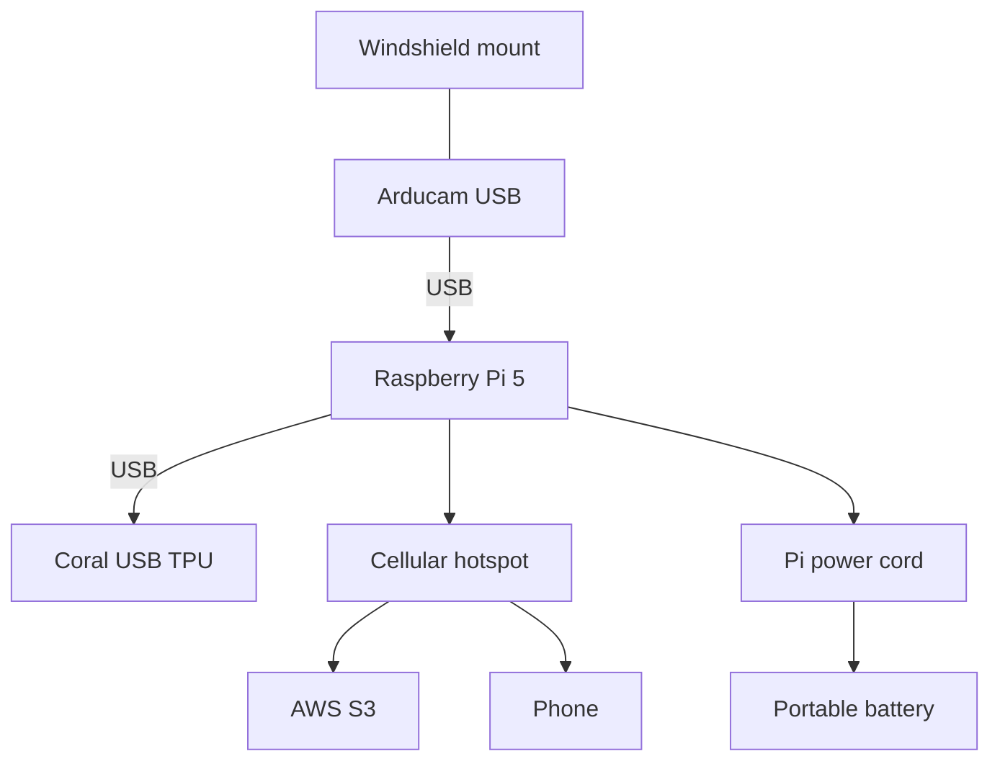
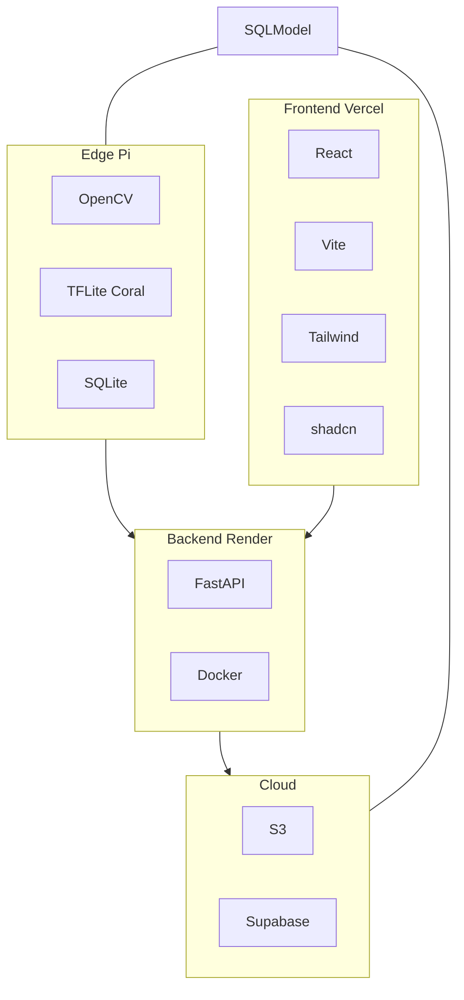

# Design Specification
**Description:** This file is intended to document the diagrams incorporated in the final design. It provides a concise, visual explanation of the project's functionality.

GitHub’s Mermaid preview cannot register Iconify packs. The landing page uses the same topology with tech logos; this spec uses text labels so the diagrams still preview on GitHub.

## Hardware Architecture Diagram
_Description:_ Raspberry Pi 5 in the center. Arducam on a windshield mount over USB. Coral TPU over USB. Cellular hotspot to S3 and the phone. Pi power cord to a portable battery.

## Software Architecture Diagram
_Description:_ Larger blocks only: Edge Pi, backend on Render, cloud, and the Vercel frontend. Unlabeled arrows between those blocks. SQLModel is a compact shared-schema node, not a full-width subgraph.

## Physical Installation Layout
_Description:_
