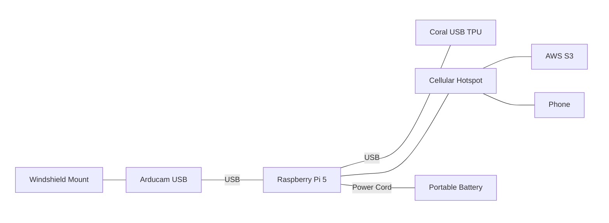
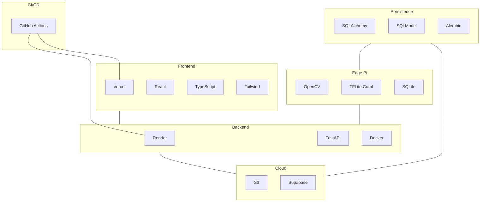

# Design Specification
**Description:** This file is intended to document the diagrams incorporated in the final design. It provides a concise, visual explanation of the project's functionality.

GitHub’s Mermaid preview cannot register Iconify packs. The landing page uses the same topology with tech logos; this spec uses text labels so the diagrams still preview on GitHub.

## Hardware Architecture Diagram
_Description:_ Three columns around the Pi. Camera stack on the left, Pi and battery in the middle (power cord labeled on the line), Coral and network on the right. Links are plain lines, not arrows.

## Software Architecture Diagram
_Description:_ GitHub Actions CI/CD sits above the runtime row and links to Render and Vercel. Edge Pi, persistence, backend, cloud, and frontend sit in one horizontal row under that. Each runtime block stacks its tools vertically. Persistence holds SQLAlchemy, SQLModel, and Alembic and links the Pi to the cloud. Other lines are unlabeled.

## Physical Installation Layout
_Description:_
